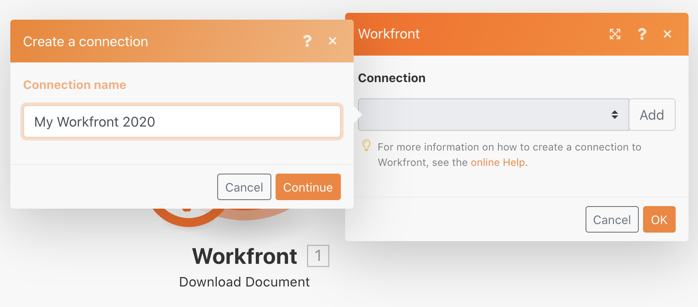

# Conception initiale du scénario

Découvrez des conseils de navigation de base pour la première connexion à Workfront Fusion et créez votre premier scénario.

## Présentation de l’exercice

Créez un projet dans Workfront pour chaque ligne du fichier CSV Liste de projets .

## Étapes à suivre

1. Créez un dossier dans la section Scénario intitulé &quot;Exercices d’activation de fusion&quot;.
1. Cliquez dans le dossier, puis sur Créer un scénario.

   

1. Sur la page suivante, recherchez Workfront et sélectionnez cette application. Cliquez ensuite sur Continuer.
1. Dans la partie supérieure gauche de l’écran du concepteur de scénarios, renommez votre scénario en &quot;Conception initiale du scénario&quot;.
1. Cliquez sur le module de déclenchement vide au centre de l’écran et sélectionnez l’application Workfront, puis sélectionnez le module Télécharger le document .

   **Authentifiez la connexion du module à votre compte Workfront.**

1. Pour créer une connexion pour la première fois, cliquez sur le bouton Ajouter .

   

1. Attribuez un nom à la connexion, par exemple &quot;Mon Workfront 2020&quot;.

   

1. Saisissez l’URL de votre instance Workfront, puis cliquez sur Suivant.

   

1. Saisissez votre mot de passe et cliquez sur Se connecter.

   **La connexion est établie. Saisissez maintenant l’ID du document que vous souhaitez télécharger à partir de Workfront.**

   

1. Revenez à Workfront. Dans le dossier &quot;Fusion Exercise Files&quot;, sélectionnez &quot;_Fusion2020_Project List.csv&quot; et cliquez sur Document Details dans le panneau de gauche. Copiez le numéro d’ID du document à partir de l’adresse URL (il s’agit du premier numéro long de l’URL).

   

1. Revenez à Fusion et collez le numéro dans le champ ID du document et cliquez sur OK.
1. Il est recommandé de renommer les modules au fur et à mesure de leur création. Cliquez avec le bouton droit de la souris sur le module Workfront et choisissez Renommer. Nommez le module &quot;Obtenir la liste des projets&quot;.

   **Ensuite, vous allez analyser le fichier CSV que vous venez de télécharger afin d’accéder à chaque ligne du fichier. Vous utiliserez ces informations lorsque vous créerez un projet à partir de chaque ligne.**

1. Cliquez sur le côté droit du module Workfront pour ajouter un autre module. Recherchez l’application CSV et sélectionnez le module Parse CSV.
1. Configurez l’analyse CSV pour 6 colonnes, le CSV contient des en-têtes, le type de délimiteur virgule et placez les données dans le champ CSV. Cliquez ensuite sur OK.

   

1. Renommez ce module &quot;Parse project list&quot; (Analyse de liste de projets).
1. Au bas du concepteur de scénario, cliquez sur Enregistrer pour enregistrer votre scénario.
1. Cliquez une fois sur Exécuter pour afficher la sortie.

   >[!NOTE]
   >
   >Ignorez l’avertissement indiquant qu’un transformateur ne doit pas être le dernier module (c’est vrai, mais cela n’a pas d’importance pour ce test). Cliquez sur Exécuter de toute façon.

   

1. Ouvrez l’Inspecteur d’exécution sur le module Parse CSV pour afficher les entrées et les sorties du module. Il existe un lot (un fichier CSV) en entrée et plusieurs lots en sortie (un lot pour chaque ligne du fichier CSV). Cela devrait ressembler à ceci :

   

   **Ajoutez un module pour créer un projet pour chaque ligne du fichier CSV.**

1. Ajoutez un autre module. Sélectionnez l’application Workfront, en choisissant le module Créer un enregistrement .
1. Définissez le type d’enregistrement sur Projet.

   >[!TIP]
   >
   >Recherchez-le en commençant à saisir quelques lettres, telles que *proj*, pour y aller directement.

1. Utilisez ensuite Cmd/Ctrl+G pour rechercher le nom (nom du projet). Cochez la case en regard de Nom ; le champ apparaît ci-dessous.
1. Désormais, cochez les cases en regard de Date et priorité de début planifiées.
1. Cliquez dans le champ Nom pour faire apparaître le panneau de mappage. Cliquez sur le champ Colonne 1 du module Analyse CSV pour l’ajouter au champ Nom . Il s’agit du nom du projet à partir du fichier CSV.
1. Pour la Date de début planifiée, cliquez sur Colonne 5 dans le module Analyse CSV.
1. Pour Priorité, sélectionnez Normale dans le menu déroulant.

   **Votre panneau de mappage doit ressembler à ceci :**

   

1. Cliquez sur OK.

   >[!NOTE]
   >
   >Si vous ne cliquez pas sur OK et que vous cliquez de nouveau accidentellement dans le concepteur, votre travail n’est pas enregistré et vous devrez effectuer une nouvelle mise en correspondance.

1. Cliquez avec le bouton droit sur le module Workfront et renommez-le &quot;Créer des projets Workfront&quot;.
1. Enregistrez votre scénario et cliquez sur le bouton Exécuter une fois .
1. Cliquez sur l’Inspecteur d’exécution en haut à droite du dernier module.

   + 20 opérations ont été effectuées. Chaque opération prenait un lot, c’est-à-dire une ligne, du fichier CSV en tant qu’entrée et sortie, un lot, qui était un projet créé dans Workfront. L’ID de projet du projet créé apparaît avec le lot de sortie.

   

   **Utilisation des notes**

1. Les notes permettent de créer plus de visibilité dans la conception de scénario. Pour ajouter une note au module Créer des projets Workfront , cliquez avec le bouton droit de la souris et sélectionnez Ajouter une note. Un panneau à droite de la fenêtre du concepteur s’affiche pour vous permettre d’ajouter une note au module. Saisissez &quot;Créer un projet avec le nom, la date de début planifiée et la priorité mappés à partir du fichier CSV&quot;.
1. Ajoutez une autre note pour décrire ce que fait le module de déclenchement (le premier module Workfront).
1. Fermez le panneau Notes en cliquant sur le X dans le coin supérieur droit.

   + Accédez à nouveau aux notes en cliquant sur le bouton Notes dans la barre d’outils inférieure ou en cliquant avec le bouton droit de la souris sur un module et en ajoutant une nouvelle note.
   + Les notes sont triées par ordre chronologique inverse.
   + Un point orange apparaît sur le bouton Notes une fois les notes ajoutées.

   

1. Enregistrez le scénario en cliquant sur le bouton Enregistrer dans la barre d&#39;outils des commandes.
1. Vous pouvez afficher les projets créés dans votre instance Workfront.
