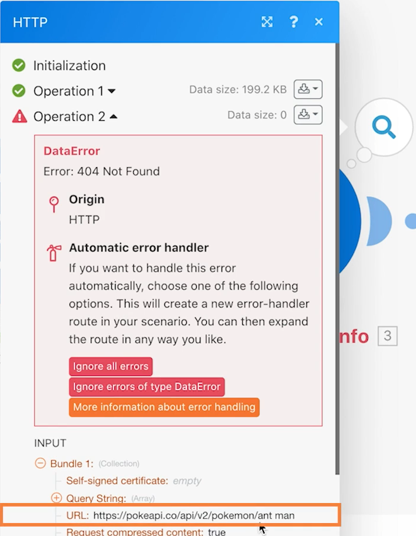

# Présentation de l’exercice sur les connecteurs universels

Découvrez plus en détail l’utilisation des connecteurs universels REST et l’utilisation des données renvoyées.

## Vue d’ensemble de l’exercice

En utilisant un personnage Pokemon dans une feuille de calcul, appelez l’API Poke par le biais d’un connecteur HTTP pour collecter et publier davantage d’informations sur ce personnage.

## Étapes à suivre

**Téléchargez le fichier CSV depuis Workfront.**

1. Dans le dossier Workfront « Fusion Exercise Files », sélectionnez « _Fusion2020_Shipping Manifest.csv » et cliquez sur Détails du document.
1. Copiez le premier numéro d’identifiant de l’adresse URL.
1. Créez un scénario dans Workfront Fusion. Nommez-le « Utiliser les connecteurs universels ».
1. Commencez par le module Télécharger le document de l’application Workfront.
1. Configurez votre connexion Workfront et incluez l’identifiant de document que vous avez copié à partir de l’URL Workfront.
1. Renommez ce module « Télécharger le manifeste d’expédition ».

   

   **Analysez les données du manifeste d’expédition.**

1. Ajoutez un autre module, en sélectionnant Analyse CSV.
1. Configurez Analyse CSV pour 11 colonnes. Vérifiez que le CSV contient bien une zone d’en-têtes. Sélectionnez le type de délimiteur virgule, puis indiquez les données du module Télécharger le document dans le champ CSV.

   

1. Renommez ce module « Analyse du manifeste d’expédition ».
1. Enregistrez le scénario et cliquez sur Exécuter une fois pour afficher les données du fichier CSV aux étapes suivantes.

   **Obtenez les données Pokemon à l’aide du connecteur universel.**

1. Ajoutez un module HTTP Make a Request.
1. Dans le champ URL, utilisez `https://pokeapi.co/api/v2/pokemon/[Character]`, où [Caractère] est mappé à la colonne 3 à partir du module Analyse CSV.
1. Cochez la case Analyser la réponse.
1. Sélectionnez Afficher les paramètres avancés, puis cochez la case en regard de « Évaluer tous les états en tant qu’erreurs ».
1. Cliquez sur OK et renommez le module « Obtenir des infos Pokemon ».

   **Votre panneau de mappage doit ressembler à ceci :**

   

   **Dans cette partie de l’exercice, vous ne traiterez que la ligne 1 du fichier CSV.**

1. Ajoutez un filtre avant votre module Obtenir des infos Pokemon. Nommez-le « Ligne 1 uniquement ».
1. Définissez la condition de manière à ce que seul l’identifiant numéro 1 puisse être transmis. L’identifiant 1 se trouve à la ligne 1 et le champ d’identifiant se trouve dans la colonne 1 du fichier CSV.

   

1. Enregistrez le scénario.
1. Cliquez sur Exécuter une fois et observez le message d’erreur que vous recevez dans le module HTTP Make a request.

   >[!IMPORTANT]
   >
   >Remarquez que, dans le champ URL des données d’entrée, le nom du personnage est en majuscules. Cela ne fonctionnera pas pour effectuer cet appel d’API, car les noms des personnages doivent être en minuscules.

   

1. Utilisez le panneau de mappage dans le champ d’URL HTTP Make a request pour mettre le champ [Personnage] entièrement en lettres minuscules, à l’aide de la fonction **lower**.

   

   **Mappez les informations provenant de l’API à l’aide du module Définir plusieurs variables.**

1. Ajoutez le module Définir plusieurs variables après Obtenir des infos Pokemon. Mappez le nom, la hauteur, le poids et les capacités.
1. Comme le champ Capacités est un tableau, pensez à utiliser la fonction map pour accéder au nom de chaque capacité dans le tableau.

   

   **Exécutez le scénario sans le filtre pour découvrir une autre erreur.**

1. Pour traiter toutes les lignes du fichier CSV, supprimez le filtre nommé Ligne 1 uniquement :

   + Cliquez sur l’icône de filtre pour apporter des modifications.
   + Supprimez le libellé du filtre.
   + Supprimez la condition.
   + Cliquez sur OK.

1. Enregistrez le scénario et cliquez sur Exécuter une fois.
1. Une erreur s’est produite dans le module Obtenir des infos Pokemon. Vous voyez qu’un personnage de super-héros a été transmis à l’API Pokemon.

   >[!NOTE]
   >
   >Dans la présentation des routeurs, vous verrez comment résoudre cette erreur en créant un chemin distinct pour traiter les super-héros.

   
