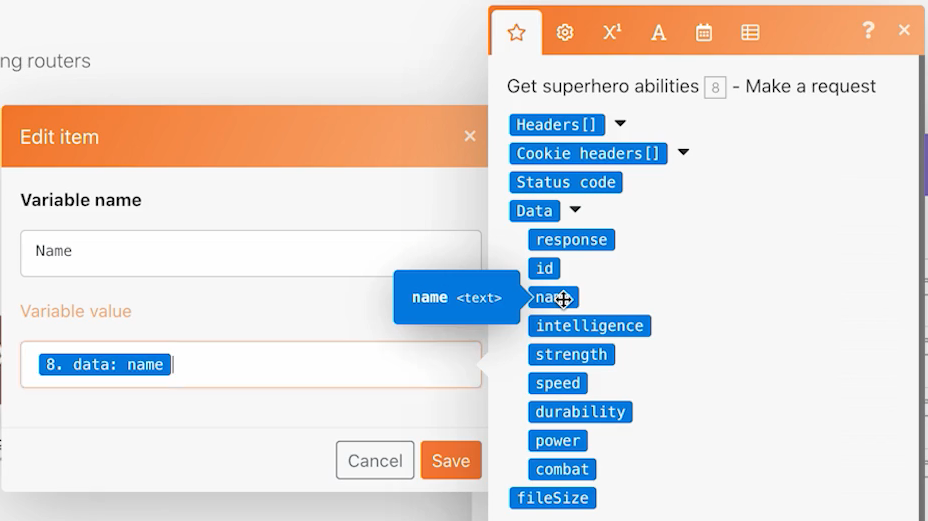
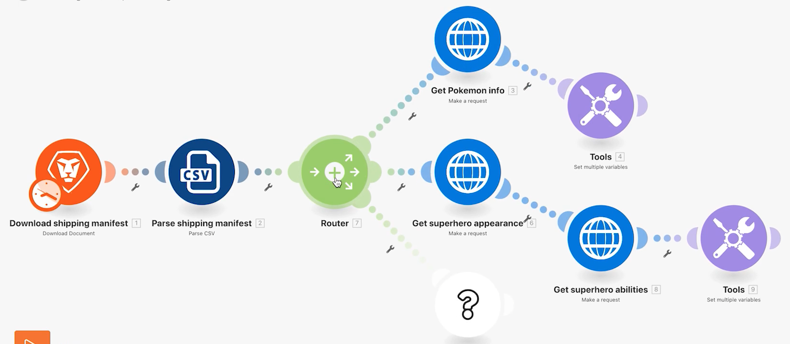

# Exercice sur les routeurs

Découvrez l’importance des routeurs et comment s’en servir pour traiter différents modules de manière conditionnelle.

## Vue d’ensemble de l’exercice

Utilisez un routeur pour faire passer les bundles Pokémon vs. super-héros par le bon chemin, puis créez une tâche pour chaque personnage.

## Étapes à suivre

1. Clonez le scénario Utilisation de connecteurs universels de l’exercice précédent. Nommez-le « Création de différents chemins à l’aide de routeurs ».

   **Créez un nouveau chemin pour les super-héros en clonant des modules et en ajoutant un routeur.**

   

1. Cliquez avec le bouton droit de la souris sur le module Obtenir des infos Pokémon et choisissez Cloner. Une fois cloné, faites-le glisser et connectez-le à la ligne entre le nouveau module HTTP et le module Analyse CSV.

   >[!NOTE]
   >
   > Remarquez qu&#39;il ajoute automatiquement un routeur avec deux chemins.

1. Nommez ce module « Obtenir l’apparence de super-héros ».
1. Clonez ce module, déplacez le clone vers la droite et nommez-le « Obtenir les pouvoirs de super-héros ».
1. Clonez le module Outils et déplacez-le à la fin du deuxième chemin.
1. Cliquez sur l’icône de la baguette (le bouton d’alignement automatique) dans la barre d’outils.

   **Votre scénario devrait ressembler à ceci :**

   

   **Ensuite, vous allez modifier les valeurs mappées dans les nouveaux modules clonés.**

1. Accédez à <https://www.superheroapi.com/> et utilisez votre compte Facebook pour obtenir un jeton d’accès.

   >[!NOTE]
   >
   >Si vous avez des difficultés à accéder à votre propre jeton de super-héros, vous pouvez utiliser ce jeton partagé : 10110256647253588. Veuillez faire attention au nombre de fois où vous appelez l’API super-héros afin que ce jeton partagé continue de fonctionner pour tout le monde.

1. Ouvrez les paramètres Obtenir l’apparence de super-héros et remplacez l’URL par `https://www.superheroapi.com/api/[access- token]/332/appearance`. Veillez à inclure votre jeton d’accès dans l’URL. Cliquez sur OK.
1. Ouvrez les paramètres Obtenir les pouvoirs de super-héros et remplacez l’URL par `https://www.superheroapi.com/api/[access- token]/332/powerstats`. Veillez à inclure votre jeton d’accès dans l’URL. Cliquez sur OK.
1. Cliquez avec le bouton droit de la souris sur chaque module super-héros et sélectionnez Exécuter ce module uniquement. Cela génère la structure de données que vous devez afficher pour le mappage.
1. Après avoir exécuté les deux, remplacez le nombre « 332 » dans chaque champ URL par la Colonne 4 mappée à partir du module Analyse CSV.

   

   **Vous pouvez maintenant cliquer sur le module Définir plusieurs variables dans le chemin de super-héros et mettre à jour le nom, la hauteur, le poids et les fonctionnalités.**

1. Mettez à jour les champs Nom et Pouvoirs du module Obtenir les pouvoirs de superhéros (module 8).

   

1. Mettez à jour les champs Hauteur et Poids du module Obtenir l’apparence de superhéros (module 6).

   

   **Lorsque vous avez terminé, vos variables devraient ressembler à ce qui suit. Notez que les numéros de module apparaissent dans les valeurs de champ.**

   

1. Cliquez sur OK, puis enregistrez votre scénario.

   **Créez un autre chemin pour créer une tâche par personnage.**

1. Dans Workfront, créez un projet vide. Nommez-le « Projet de manifeste d’expédition » et copiez l’ID du projet à partir de l’URL.
1. Retournez dans Workfront Fusion et cliquez au centre du routeur pour créer un autre chemin.

   

1. Cliquez au centre du module vide qui apparaît et ajoutez un module Créer un enregistrement à partir de l’application Workfront.
1. Définissez Type d’enregistrement sur Tâche et sélectionnez ID du projet dans la section Champs à mapper.
1. Collez l’ID du projet que vous avez copié depuis Workfront dans le champ ID du projet.
1. Sélectionnez ensuite le champ Nom dans la section Champs à mapper.
1. Nommez la tâche « [Personnage] de [franchise] » en prenant le nom du personnage et le nom de la franchise dans le fichier CSV. La colonne 3 correspond au nom du personnage et la colonne 2 au nom de la franchise.

   

1. Cliquez sur OK et renommez ce module « Créer une tâche pour chaque personnage ».

   **Ajoutez des filtres pour que le scénario puisse se dérouler sans erreur. Vous voulez que seuls les Pokémon empruntent le chemin du haut, que seuls les super-héros empruntent le chemin du milieu et que tous les personnages empruntent le chemin du bas.**

1. Cliquez sur la ligne pointillée à gauche du module Obtenir des informations sur les Pokémon pour créer le premier filtre. Nommez-le « Personnage Pokémon ».
1. Pour la condition, seuls les enregistrements où la franchise (colonne 2) est « Pokémon » sont autorisés. Choisissez l’opérateur de texte « Egal à ».
1. Cliquez sur la ligne pointillée à gauche du module « Obtenir l’apparence de super-héros » pour créer le filtre suivant. Nommez-le « Personnage super-héros ».
1. Les super-héros pouvant provenir de différentes franchises, utilisez le champ ID Super-héros (colonne 4) pour déterminer si un personnage est un super-héros ou non.

   **Vos filtres devraient ressembler à ceci :**

   

   

1. Enregistrez le scénario et cliquez sur Exécuter une fois. Utilisez les inspecteurs d’exécution pour vérifier que toutes les opérations ont réussi et vérifiez les tâches qui ont été créées dans votre projet Workfront.

   
