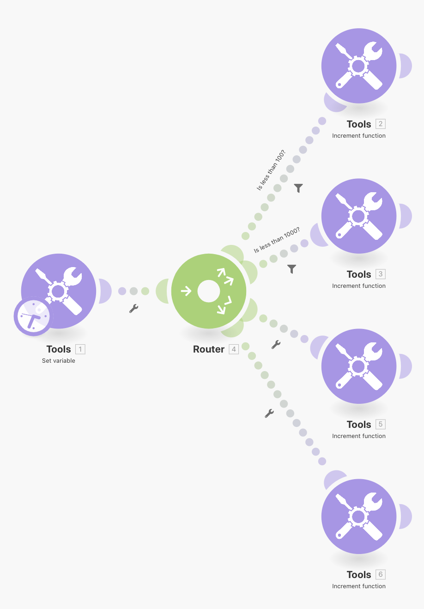
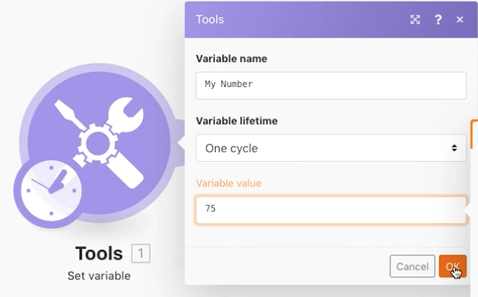

# Modèles de routage

Renforcer votre concept d’acheminement et d’itinéraires de secours sans réellement traiter avec d’autres API.

## Présentation de l’exercice

Utilisez le module Set Variable (Définir la variable) pour envoyer un nombre à travers plusieurs chemins afin de visualiser le comportement des filtres et des secours lors du routage.

## Étapes à suivre

1. Créez un nouveau scénario et appelez-le &quot;Modèles de routage et abandons&quot;.
1. Pour le déclencheur, ajoutez le module d’outil Définir la variable . Saisissez &quot;Mon numéro&quot; pour le nom de la variable, laissez la durée de vie de la variable comme un cycle, puis définissez le champ Variable sur &quot;75&quot;.

   

1. Ajoutez un autre module et choisissez le module routeur. Pour les deux chemins, sélectionnez l’outil de fonction Incrémenter et cliquez sur OK sans apporter de modifications pour chacun d’eux.

   + Pour le premier chemin, créez un filtre, nommez-le &quot;Inférieur à 100&quot;, puis définissez la condition sur [Mon numéro] Moins de 100.

   + Pour le deuxième chemin, créez un filtre, nommez-le &quot;Inférieur à 1 000&quot;, puis définissez la condition sur [Mon numéro] Moins de 1000. Veillez à utiliser l’opérateur Numérique pour les deux.

   

   

1. Cliquez une fois sur Exécuter et regardez le lot transmettre le chemin &quot;Moins de 100&quot;.
1. Définissez ensuite le champ Définir la variable sur 950 et Exécutez à nouveau. Regardez-le courir le long du deuxième chemin.
1. Cliquez sur le routeur et ajoutez un autre chemin. Ajoutez le module d’outil de fonction Incrémenter . Pour le filtre, cliquez sur la case à cocher &quot;L’itinéraire de secours&quot;. Notez comment la flèche pointant vers ce chemin se transforme en accent circonflexe, indiquant qu’il s’agit de l’itinéraire de secours.

   

1. Définissez le numéro de variable sur 9500 et Exécutez une fois. Comme le nombre n’est pas inférieur à 100 ou moins de 1 000, le lot emprunte l’itinéraire de secours.

Si vous ajoutez un autre chemin avec un module d’outil de fonction d’incrémentation, mais ne définissez aucun filtre, que se passera-t-il lorsque vous cliquerez de nouveau sur Exécuter ? Un lot sera-t-il un jour sur l’itinéraire de secours avec le quatrième itinéraire ajouté ?

+ Non, car sans filtre défini, chaque lot va toujours suivre ce chemin au lieu de l’itinéraire de secours.
