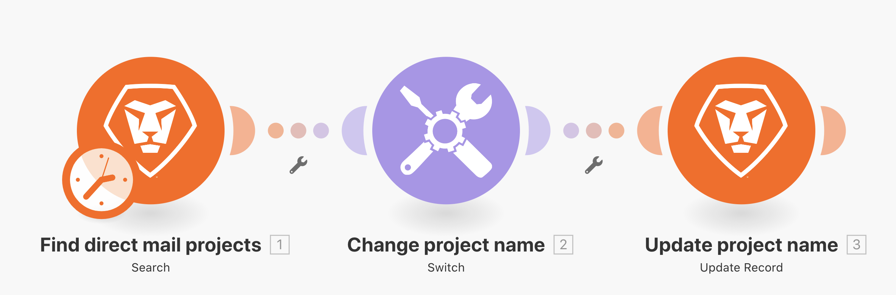
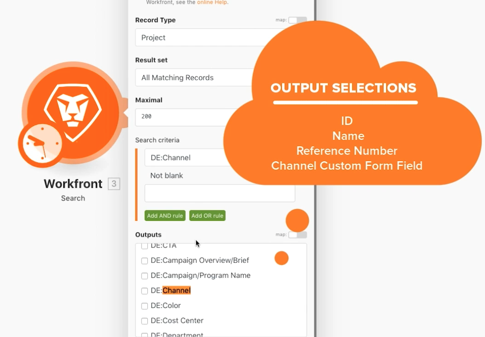
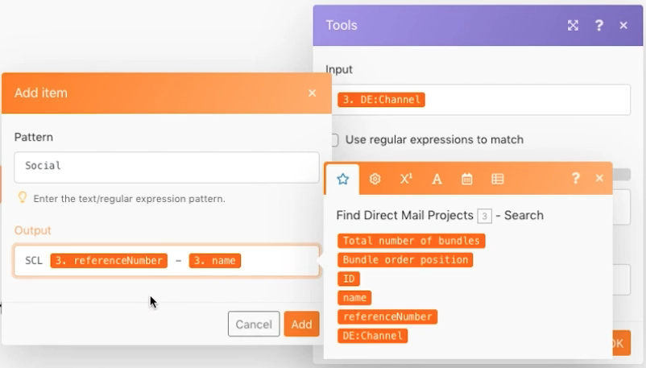

# Exercice sur le module Switch

Découvrez comment utiliser le module Switch lorsque vous devez effectuer des transformations de données plus complexes ou dynamiques.

## Vue d’ensemble de l’exercice

Recherchez des projets de publipostage direct dans votre lecteur de test, puis modifiez le nom de chaque projet en fonction d’une valeur sélectionnée dans un champ personnalisé associé au projet.

## Étapes à suivre

1. Créez un scénario et nommez-le « Utilisation du module Switch ».
1. Pour le module déclencheur, utilisez le module Recherche de Workfront.
1. Configurez votre connexion Workfront et définissez le type d’enregistrement sur Projet.
1. Dans les critères de recherche, indiquez que vous souhaitez uniquement afficher les projets ayant une valeur dans le champ personnalisé Canal.
1. Pour les sorties, sélectionnez ID, Nom, Numéro de référence et le champ personnalisé Canal.

   

1. Ajoutez le module Switch à partir des outils.
1. Pour le champ de saisie, mappez le champ personnalisé Canal à partir du module Recherche.

   

1. Ajoutez ensuite des cas pour chaque valeur possible provenant du champ personnalisé Canal. La valeur possible est indiquée dans le champ Motif. Il est préférable que le champ de sortie contienne un code à 3 lettres spécifique, suivi du numéro de référence du projet, puis du nom du projet.

   **Votre panneau de mappage doit ressembler à ceci :**

   

1. Vous pouvez ajouter autant de cas supplémentaires que vous le souhaitez. Remarquez le champ Autres au bas de la page. Il sera utilisé si la valeur d’entrée ne correspond à aucun des cas.

   **Mettez à jour le nom du projet dans Workfront.**

   

1. Ajoutez un module d’enregistrement de mise à jour Workfront.
1. Dans le champ ID, mappez à l’ID à partir du module de déclenchement.
1. Définissez le Type d’enregistrement sur Projet.
1. Sélectionnez le champ Nom dans la section Sélectionner les champs à mapper, puis mappez-le à la sortie du module Switch.
1. Enregistrez votre scénario et exécutez-le une fois. Affichez les noms de projet mis à jour dans votre lecteur de test.
