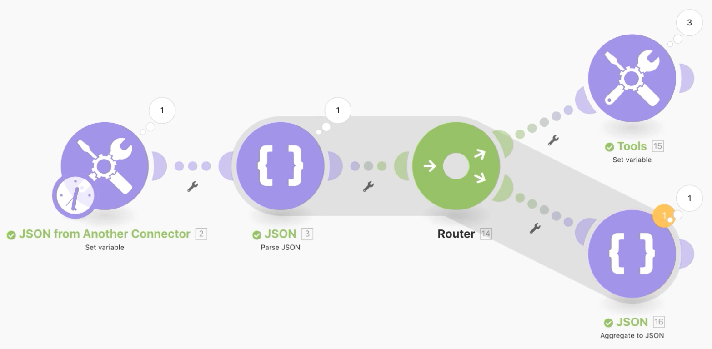
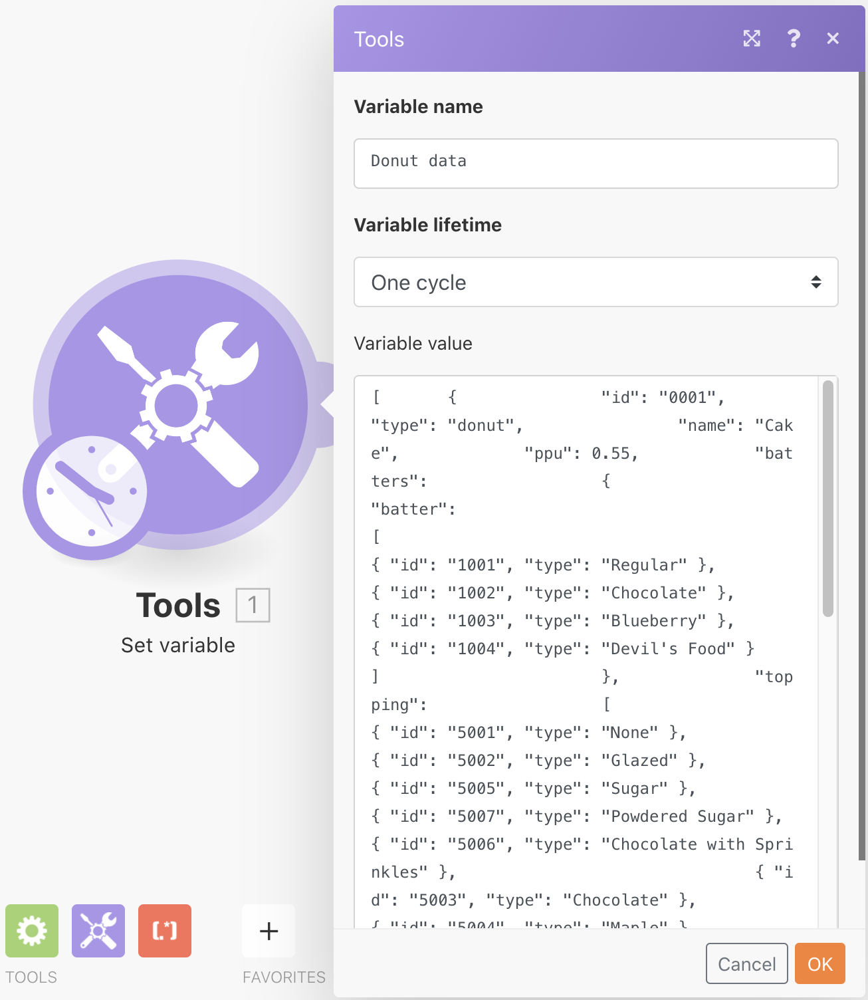
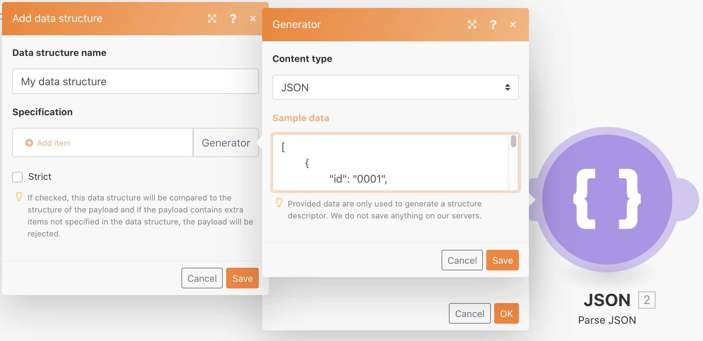
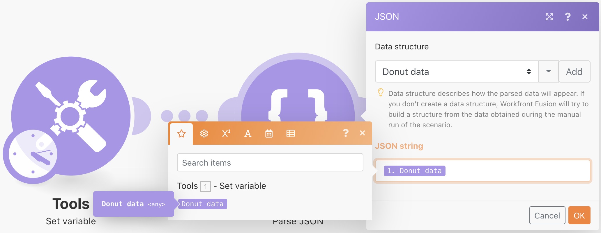
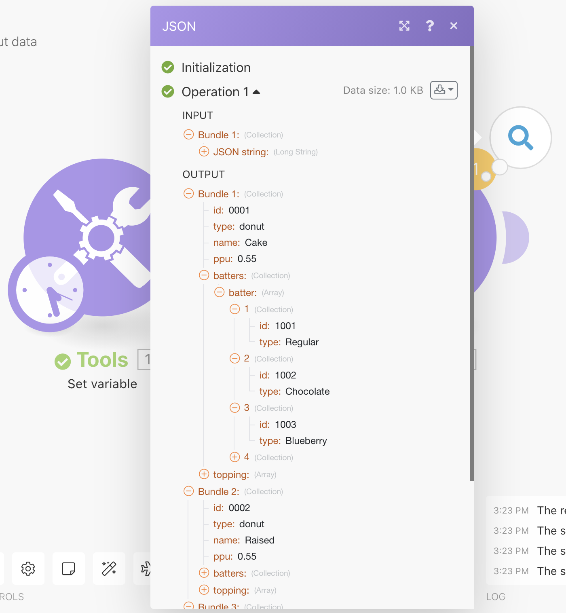
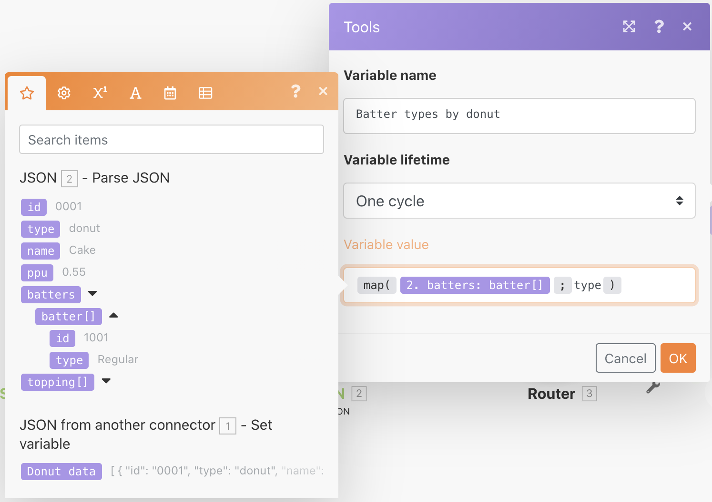
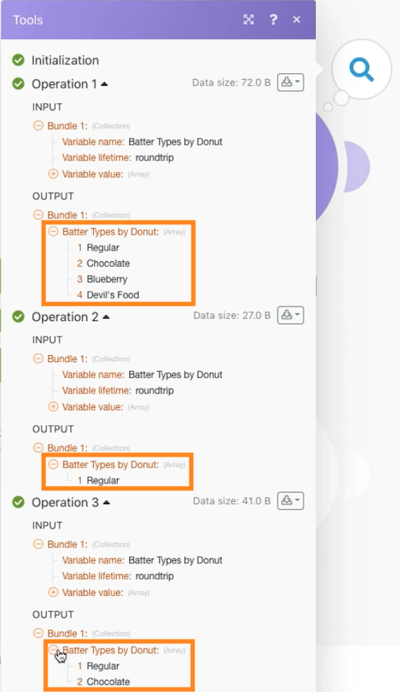
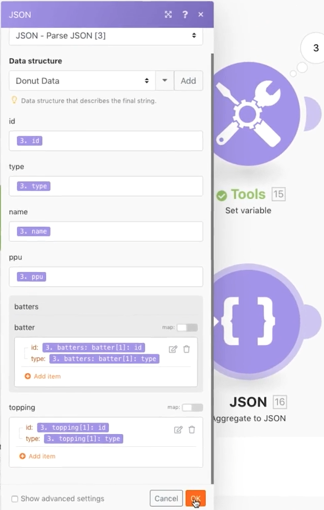
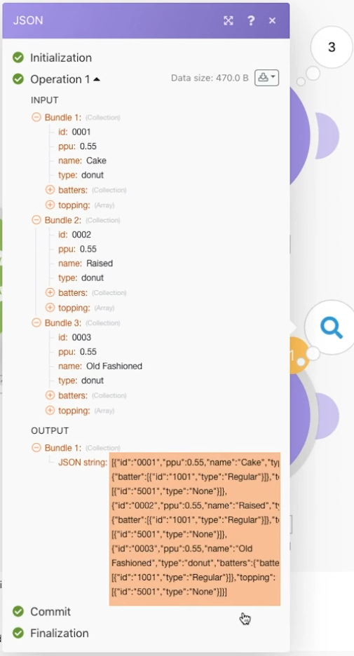

# Exercice sur l’utilisation de JSON

Découvrez comment créer et analyser JSON dans un scénario pour répondre à vos besoins en matière de conception.

## Vue d’ensemble de l’exercice

L&#39;objectif de cet exercice est de montrer de manière conceptuelle comment utiliser les informations envoyées dans un scénario au format JSON, en les analysant dans des champs et des éléments que vous pouvez mapper dans votre scénario. Vous pouvez ensuite extraire des informations de ces tableaux mappés ou les agréger en JSON pour les envoyer à un autre système qui est paramétré pour recevoir du JSON en entrée.

## Étapes à suivre

**Créez une structure de données et d’analyse JSON.**

1. Créez un nouveau scénario et nommez-le « Travailler sur des données JSON de type Donut ».
1. Pour le module déclencheur, utilisez le module Définir une variable.
1. Pour le nom de la variable, saisissez « Données Donut ».
1. Pour la valeur de la variable, copiez et collez le contenu du document « _Donut Data - Sample JSON.rtf » qui se trouve dans le dossier « Fusion Exercise Files » de votre disque dur de test.

   

1. Renommez ce module « JSON depuis un autre connecteur ».
1. Ajoutez un module d’analyse JSON.
1. Cliquez sur Ajouter pour le champ Structure des données.
1. Sélectionnez le Générateur et collez dans le champ de données d’exemple les données « Donut Data - Sample JSON » que vous avez copiées.

   

1. Cliquez sur Enregistrer, et nommer la structure de données « Données Donut ». Cliquez ensuite sur Enregistrer.
1. Mappez les données Donut issues du module Définir une variable dans le champ de chaîne JSON.

   

1. Enregistrez votre scénario, puis cliquez sur Exécuter une fois pour afficher la sortie.

   **La sortie du module d’analyse JSON doit ressembler à celle-ci : **

   

   **Mapper vers des variables de tableau spécifiques.**

1. Ajoutez un routeur après le module d’analyse JSON.
1. Dans le chemin supérieur, ajoutez un module Définir une variable.
1. Pour le nom de la variable, saisissez « Types de pâtes par donut ».
1. Pour la valeur de la variable, utilisez la fonction de mappage pour obtenir les types de pâtes à partir du tableau des pâtes.

   

1. Cliquez sur OK, puis sur Exécuter une fois.
1. Ouvrez l’inspecteur d’exécution pour voir les ensembles de sortie pour chacune des trois opérations, celui-ci indiquant les types de pâtes pour chacune d’entre elles.

   

   **Agréger des données de scénario avec JSON.**

1. Sur le chemin de routage inférieur, ajoutez un agrégat au module JSON.
1. Pour le module source, choisissez l’itérateur : le module d’analyse JSON.
1. Pour la structure de données, créez ou choisissez n’importe quelle structure de données. Pour cet exemple, nous utiliserons les données Donut.
1. Dans le cadre de cet exemple, mappez les champs directement comme indiqué ci-dessous.
1. Lorsque vous arrivez à la pâte et à la garniture, vous remarquez qu’il s&#39;agit de tableaux et que vous devez donc cliquer sur Ajouter un élément pour les mapper.

   

1. Enregistrez le scénario et cliquez sur Exécuter une fois.

Consultez l’inspecteur d’exécution pour le module d’agrégat avec JSON : vous remarquerez que vous avez pu agréger trois ensembles dans une seule chaîne JSON. Vous pouvez ensuite envoyer cette chaîne à d’autres systèmes disposés à recevoir du JSON.

