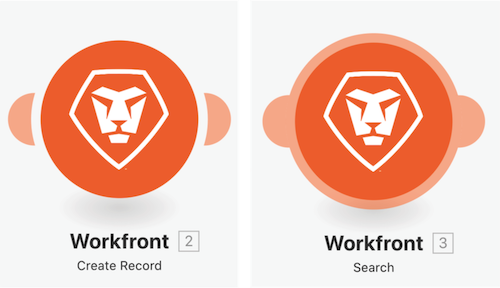

# Accéder à la présentation des versions précédentes

Dans cette vidéo, vous allez :

* Découvrez comment restaurer des versions précédentes après avoir modifié votre scénario et enregistré plusieurs fois.

## Accéder à la présentation des versions précédentes

Workfront recommande de regarder la vidéo de présentation de l’exercice avant d’essayer de recréer l’exercice dans votre propre environnement.

>[!VIDEO](https://video.tv.adobe.com/v/3416535/?captions=fre_fr&quality=12&learn=on&enablevpops=1)

>[!NOTE]
>
>Après avoir sauvegardé votre scénario, une nouvelle version est disponible dans le menu à trois points si vous avez besoin d’y accéder ultérieurement. Les versions de scénario sauvegardées précédemment ne sont disponibles que pendant 60 jours. Si vous devez accéder à des versions précédentes après les 60 jours à des fins d’audit, Workfront recommande de sauvegarder un plan directeur de votre scénario et de l’archiver dans un endroit convenu.

## Compléter votre terminologie

### Modules déclencheurs

Les modules de déclencheur ne peuvent être utilisés qu’en tant que premier module et peuvent renvoyer zéro, un ou plusieurs bundles. Ils seront traités individuellement dans les modules suivants, à moins qu’ils ne soient agrégés.

**Déclencheur d’attente active (déclencheur avec horloge)** : fonction spéciale permettant de garder la trace du dernier enregistrement traité.

**Déclencheur instantané (déclencheur avec éclair)** : déclenchement immédiat sur la base d’un webhook.

### Actions et modules de recherche

**Action** : utilisée pour effectuer des opérations CRUD (création, lecture, mise à jour et suppression).

**Recherches** : permet de rechercher zéro, un ou plusieurs enregistrements et de les renvoyer sous forme de bundles, qui seront traités individuellement dans les modules suivants, à moins qu’ils ne soient agrégés.

## Vous voulez en savoir plus ? Nous recommandons ce qui suit :

[Documentation de Workfront Fusion](https://experienceleague.adobe.com/fr/docs/workfront-fusion/using/get-started-with-fusion/understand-workfront-fusion/workfront-fusion-overview)
