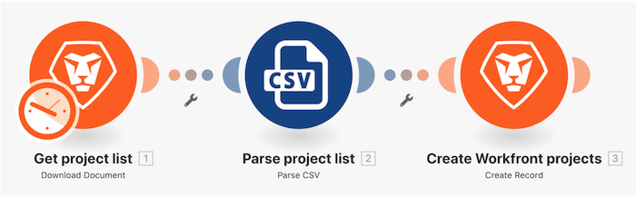

# Au-delà de la présentation du mappage de base

Modifiez le nom du projet, la date de début planifiée et la priorité de la « conception du scénario initial » que vous avez créée lors de la première présentation à l’aide des formules du panneau de mappage.

## Au-delà de la présentation du mappage de base

Workfront recommande de regarder la vidéo de présentation de l’exercice avant d’essayer de recréer l’exercice dans votre propre environnement.

>[!VIDEO](https://video.tv.adobe.com/v/335264/?quality=12&learn=on&enablevpops=1)

## À vous

>[!NOTE]
>
>Les exercices pratiques et les défis sont facultatifs et ne sont pas nécessaires pour terminer la formation Fusion.

Cet exercice repose sur ce que vous avez appris dans la présentation, mais la solution n’est pas fournie.

Créez un clone de la présentation « Au-delà du mapping de base » que vous venez de terminer. Vous continuerez à utiliser ce scénario dans la prochaine présentation, il est donc préférable de ne pas le modifier avec cet exercice.

Créez une tâche dans chaque projet que vous avez créé dans le cadre de la présentation précédente.

* Utilisez « Planification initiale d’un projet (couleur du projet) » comme nom de la tâche.
* Définissez la date de début prévue sur la même que la date de début prévue du projet.
* Définissez la durée sur 3 jours et le type de durée sur Calcul d’affectation.
* Définissez les heures planifiées sur 10 % du degré de confiance en heures.
* Définissez la contrainte de tâche sur Dès que possible.

**Défi :** si la couleur du projet est Rouge, assignez la tâche à Rick Kuvec. Si la couleur du projet est Jaune, assignez la tâche à Mary Smith. Si la couleur du projet est Vert, affectez la tâche à Ida Blankenship.

## Vous voulez en savoir plus ? Nous recommandons ce qui suit :

[Documentation de Workfront Fusion](https://experienceleague.adobe.com/fr/docs/workfront-fusion/using/get-started-with-fusion/understand-workfront-fusion/workfront-fusion-overview)
