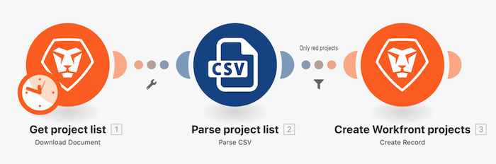

# Présentation des filtres

À l’aide de l’exercice « Au-delà du mappage de base » que vous avez créé précédemment, ajoutez un filtre entre les deux modules dans les modules pour ne créer que des projets qui ont une couleur « rouge » dans la liste des projets.

## Présentation des filtres

Workfront recommande de regarder la vidéo de présentation de l’exercice avant d’essayer de recréer l’exercice dans votre propre environnement.

Dans cette vidéo, vous apprendrez à :

* Ajouter un filtre entre les deux modules dans les modules

>[!VIDEO](https://video.tv.adobe.com/v/335266/?quality=12&learn=on)

## À vous

>[!NOTE]
>
>Les exercices pratiques et les défis sont facultatifs et ne sont pas nécessaires pour terminer la formation Fusion.

Cet exercice repose sur ce que vous avez appris dans la présentation, mais la solution n’est pas fournie.

Modifiez le filtre que vous avez créé lors de la présentation des filtres pour n’autoriser que les projets « jaunes » et dont la note de confiance est inférieure à 100 ou qui comportent le mot « phase » dans le nom du projet et dont la date de début prévue est en 2021. Nommez le filtre « Filtre de l’exercice pratique ».

**Défi :** essayez de créer un filtre qui ne laisse passer que les projets ayant une note de confiance égale. Besoin d’un indice ? Pensez aux formules mathématiques.

## Vous voulez en savoir plus ? Nous recommandons ce qui suit :

[Documentation sur Workfront Fusion](https://experienceleague.adobe.com/docs/workfront/using/adobe-workfront-fusion/workfront-fusion-2.html?lang=fr)
