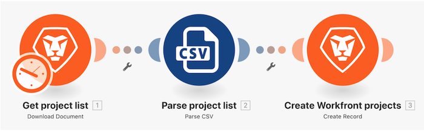

# Présentation de la conception du scénario initial

Créez un nouveau projet dans Workfront pour chaque ligne du fichier CSV de la liste des projets.

Workfront recommande de regarder la vidéo de présentation de l’exercice avant d’essayer de recréer l’exercice dans votre propre environnement.

Dans cette vidéo, vous apprendrez à :

* Créer des dossiers et de nouveaux scénarios
* Utiliser le concepteur de scénarios
* Créer un scénario de base

>[!VIDEO](https://video.tv.adobe.com/v/335261/?quality=12&learn=on)

## Vous voulez en savoir plus ? Nous recommandons ce qui suit :

[Documentation sur Workfront Fusion](https://experienceleague.adobe.com/docs/workfront/using/adobe-workfront-fusion/workfront-fusion-2.html?lang=fr)
