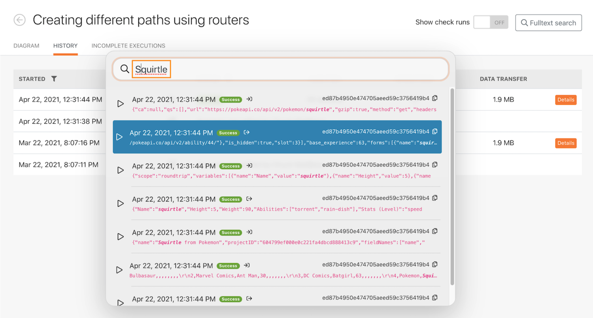

# Présentation de l’historique d’exécution

## Vue d’ensemble

Passez en revue l’historique d’exécution pour le scénario &quot;Utilisation du puissant filtre&quot; afin de comprendre ce qui s’est passé lors des exécutions et la manière dont elles ont été structurées lors de leur exécution.

## Présentation de l’historique d’exécution

Workfront recommande de regarder la vidéo de présentation de l’exercice avant d’essayer de recréer l’exercice dans votre propre environnement.

>[!VIDEO](https://video.tv.adobe.com/v/335283/?quality=12)

>[!TIP]
>
>Pour obtenir des instructions détaillées sur la manière d’effectuer la présentation, accédez à la section [Présentation de l’historique d’exécution](https://experienceleague.adobe.com/docs/workfront-learn/tutorials-workfront/fusion/exercises/execution-history.html?lang=en) exercice.

## Recherche de texte intégral dans l’onglet Historique

La recherche de texte intégral est disponible dans l’onglet Historique d’un scénario, ce qui vous permet de rechercher toutes les données traitées dans le scénario.

Au lieu d’ouvrir chaque exécution pour rechercher des données, la recherche de texte intégral recherche toutes les exécutions dans un seul scénario. Les résultats de recherche fournissent une liste des exécutions où les données ont été trouvées. Vous pouvez cliquer sur n’importe quelle exécution pour explorer plus en détail.

Les résultats de la recherche contiennent quelques icônes utiles dans l’image ci-dessous.

A : état de l’exécution.

B : indique si les données se trouvaient dans l’entrée ou la sortie du module dans lequel elles ont été trouvées.

C : ID d’exécution.

D : Copiez l’ID d’exécution.

Lorsque vous cliquez sur une exécution, Workfront Fusion charge l’exécution et le module dans lequel le résultat de la recherche a été trouvé. Et il ouvre l’Inspecteur d’exécution sur le module qui contient les données de recherche.

## Vous souhaitez en savoir plus ? Nous vous recommandons ce qui suit :

[Documentation de Workfront Fusion](https://experienceleague.adobe.com/docs/workfront/using/adobe-workfront-fusion/workfront-fusion-2.html?lang=en)
