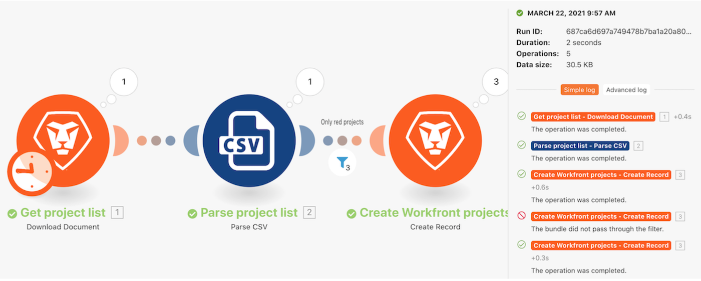

# Présentation de l’historique d’exécution

Examinez l’historique des exécutions du scénario « Utilisation du filtre de puissance » pour comprendre ce qui s’est passé lors des exécutions et comment elles ont été structurées au moment où elles ont été exécutées.

## Présentation de l’historique d’exécution

Workfront recommande de regarder la vidéo de présentation de l’exercice avant d’essayer de recréer l’exercice dans votre propre environnement.

>[!VIDEO](https://video.tv.adobe.com/v/335283/?quality=12&learn=on)

## Recherche en texte intégral dans l’onglet Historique

La recherche en texte intégral est disponible dans l’onglet Historique d’un scénario, ce qui vous permet de rechercher toutes les données traitées dans le scénario.

Au lieu d’ouvrir chaque exécution pour rechercher des données, la recherche en texte intégral porte sur toutes les exécutions au sein d’un même scénario. Les résultats de la recherche fournissent une liste d’exécutions où les données ont été trouvées. Vous pouvez cliquer sur n’importe quelle exécution pour obtenir plus de détails.

Les résultats de la recherche contiennent quelques icônes utiles dans l’image ci-dessous.

A - Le statut de l’exécution.

B - Indique si les données se trouvaient dans l’entrée ou la sortie du module dans lequel elles ont été trouvées.

C - L’identifiant d’exécution.

D - Copier l’identifiant d’exécution.

Lorsque vous cliquez sur une exécution, Workfront Fusion charge l’exécution et le module dans lequel le résultat de la recherche a été trouvé. Il ouvre également l’inspecteur d’exécution sur le module qui contient les données de recherche.

## Vous voulez en savoir plus ? Nous recommandons ce qui suit :

[Documentation sur Workfront Fusion](https://experienceleague.adobe.com/docs/workfront/using/adobe-workfront-fusion/workfront-fusion-2.html?lang=fr)
