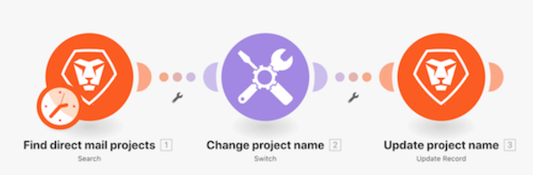

# Présentation du module Switch

Découvrez comment utiliser le module Switch lorsque vous devez effectuer des transformations de données plus complexes ou dynamiques.

## Présentation du module Switch

Workfront recommande de regarder la vidéo de présentation de l’exercice avant d’essayer de recréer l’exercice dans votre propre environnement.

>[!VIDEO](https://video.tv.adobe.com/v/335290/?quality=12&learn=on)

## Vous voulez en savoir plus ? Nous recommandons ce qui suit :

[Documentation sur Workfront Fusion](https://experienceleague.adobe.com/docs/workfront/using/adobe-workfront-fusion/workfront-fusion-2.html?lang=fr)
