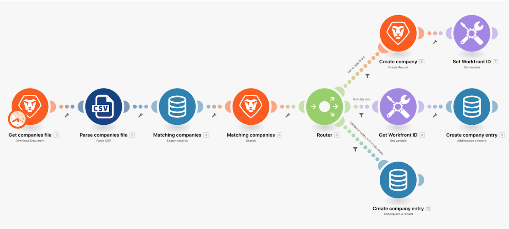

# Présentation des entrepôts de données

## Vue d’ensemble

Au cours de cet exercice, nous utilisons un entrepôt de données pour synchroniser les noms d’entreprise entre une liste d’entreprises et Workfront.

Il s’agit d’une partie d’une synchronisation unidirectionnelle entre les entreprises de Workfront et d’un autre système. Pour l’instant, il ne se synchronise qu’entre un fichier CSV et Workfront. Mais il conserve également un tableau dans un entrepôt de données qui suit le Workfront ID (WFID) et l’ID de société dans le fichier CSV (CID) pour chaque société. Cela nous permettra d&#39;en faire une synchronisation bidirectionnelle à un moment ou à un autre.

## Présentation des entrepôts de données

Workfront recommande de regarder la vidéo de présentation de l’exercice avant d’essayer de recréer l’exercice dans votre propre environnement.

>[!VIDEO](https://video.tv.adobe.com/v/335296/?quality=12)

>[!TIP]
>
>Pour obtenir des instructions détaillées sur la manière d’effectuer la présentation, accédez à la section [Présentation des entrepôts de données](https://experienceleague.adobe.com/docs/workfront-learn/tutorials-workfront/fusion/exercises/data-stores.html?lang=en) exercice.

## Note finale

Maintenant que vous avez terminé d’en savoir plus sur les structures de données et les entrepôts de données, vous vous demandez peut-être : &quot;Quand devriez-vous les utiliser ?&quot;

Les structures de données sont généralement utilisées pour sérialiser ou analyser des formats de données tels que JSON, XML, CSV, etc. Les structures de données vous permettent de contrôler la structure de vos données et même de valider les données. La raison la plus courante pour laquelle vous utilisez une structure de données est de créer des données valides à envoyer à une API qui attend JSON ou XML. Dans ce cas, vous souhaiterez utiliser l’application JSON ou XML avec votre structure de données pour vous assurer que les données sont au bon format.

Les entrepôts de données ne doivent être utilisés que pour stocker les données persistantes auxquelles plusieurs scénarios d’exécution doivent accéder. Par exemple, vous pouvez stocker des métadonnées sur le dernier enregistrement traité pour des cas d’utilisation avancés nécessitant un contrôle précis sur le traitement.

Les entrepôts de données ne sont pas conçus pour être utilisés comme un entrepôt de données ou une journalisation. Les entrepôts de données ne sont pas accessibles en dehors de Workfront Fusion et la plupart des interactions avec les entrepôts de données se font par le biais d’un scénario de fusion Workfront. Par conséquent, il n’est pas possible de connecter un entrepôt de données à un outil d’analyse ou de création de rapports qui serait attendu pour l’entrepôt de données et les cas d’utilisation de la journalisation. Le rôle de Workfront Fusion dans de tels cas d’utilisation serait de renseigner un système approprié pour l’organisation et le stockage des données (SQL, MariaDB, par exemple).

## Vous souhaitez en savoir plus ? Nous vous recommandons ce qui suit :

[Documentation de Workfront Fusion](https://experienceleague.adobe.com/docs/workfront/using/adobe-workfront-fusion/workfront-fusion-2.html?lang=en)
