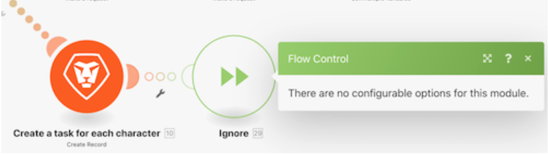

# Présentation des directives de gestion des erreurs

Dans cette vidéo, vous apprendrez :

* Les trois directives de gestionnaire d’erreurs qui permettent à l’exécution de continuer
* Les deux directives de gestionnaire d’erreurs qui arrêtent l’exécution

>[!VIDEO](https://video.tv.adobe.com/v/335305/?quality=12&learn=on&enablevpops=1)

## Directives - Le scénario continue

### Reprendre

* Une sortie de substitution est spécifiée et fournie au module qui rencontre une erreur.
* Les modules suivants sont traités.
* Le statut d’exécution du scénario est marqué comme « succès ».

### Interrompre

* Le statut de l’exécution du scénario est stocké dans la file d’attente des exécutions incomplètes où l’erreur peut être résolue manuellement. Quelques exceptions sont mentionnées ici.
* Les modules suivants ne sont pas traités.
* S’il existe des bundles non traités, l’exécution du scénario se poursuit normalement.
* Le statut d’exécution du scénario est marqué comme « avertissement ».

### Ignorer

* L’erreur est ignorée et les modules suivants ne sont pas traités.
* S’il existe des bundles non traités, l’exécution du scénario se poursuit normalement.
* Le statut d’exécution du scénario est marqué comme « succès ».

## Directives - Arrêt du scénario

### Restauration

* L’exécution du scénario s’arrête immédiatement et une phase de restauration démarre sur tous les modules afin de tenter de rétablir leur état initial.
* Les modules suivants ne sont pas traités.
* À l’exception de certains types d’erreur, le scénario est désactivé après le « nombre d’erreurs consécutives » spécifié dans les paramètres du scénario.
* Le statut d’exécution du scénario est marqué comme « erreur ».

>[!NOTE]
>
>Il s’agit du comportement par défaut si aucun itinéraire de gestionnaire d’erreurs n’est associé au module et que le paramètre « Autoriser le stockage des exécutions incomplètes » dans Paramètres du scénario n’est pas coché.

### Valider

* L’erreur est ignorée et les modules suivants ne sont pas traités.
* S’il existe des bundles non traités, l’exécution du scénario se poursuit normalement.
* Le statut d’exécution du scénario est marqué comme « succès ».

