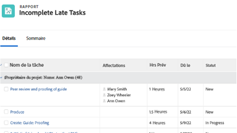

# Tutoriels Workfront {#overview}

Une bibliothèque de vidéos de formation et d’articles conçus pour vous aider à mieux comprendre les fonctionnalités et les paramètres de Workfront.  Elle comprend un ensemble de bonnes pratiques, d’exercices organisés et d’autres ressources qui vous aideront, ainsi que votre organisation, à réussir avec Workfront.

>[!VIDEO](https://video.tv.adobe.com/v/335063/?quality=12&learn=on)

<!-- 

This is the landing page of the user guide. It should be the first list item in the TOC.md file. 
See other user landing pages to get ideas. 

-->

## Sélections du personnel

<table style="margin-top: 0 !important">
  <tr>
   <td>
      
      

         <a href="/help/administration-and-setup/layout-templates/find-layout-templates.md"><strong>Rechercher et créer des modèles de disposition</strong></a>
      

      

         <em>Découvrez comment créer un modèle de disposition de base.</em>
      

    </td>
   <td>
      
      

         <a href="/help/manage-work/issues-requests/make-a-request.md"><strong>Effectuer une requête</strong></a>
      

      

         <em>Découvrez comment créer, afficher et modifier des requêtes.</em>
      

<td>
      
      

         <a href="/help/reporting/basic-reporting/create-a-simple-report.md"><strong>Créer un rapport simple</strong></a>
      

      

         <em>Découvrez comment créer un rapport personnalisé simple.</em>
      

    </td>
  </tr>
</table>

