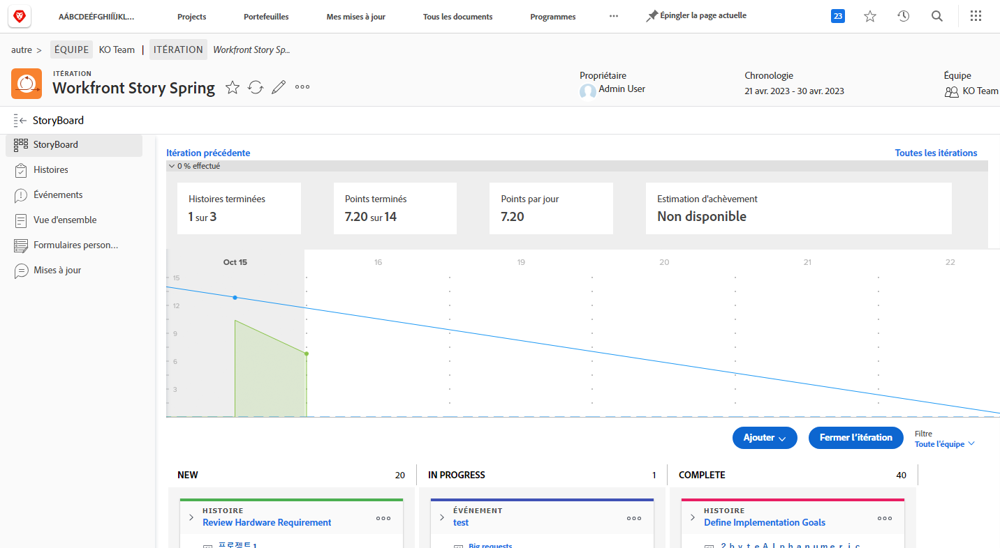
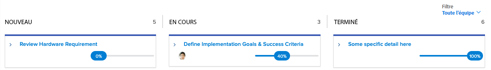

# Créer de la visibilité avec l’intégration [!DNL Jira]

[!DNL Jira] est un produit utilisé pour suivre les projets et les problèmes des équipes de développement et de support technique. Alors que de nombreuses équipes utilisent Jira pour suivre l’avancement des tâches, elles utilisent [!DNL Workfront] pour effectuer une véritable gestion de projet, car elles peuvent obtenir une vue d’ensemble de l’avancement. Avec l’intégration native [!DNL Jira], cette information peut automatiquement être transférée entre les deux applications.

## En quoi consiste [!DNL Jira] ?

[!DNL Jira] est un produit créé par [!DNL Atlassian] pour suivre les projets et les problèmes des équipes de développement et de support technique. De nombreuses équipes utilisent [!DNL Jira] pour suivre l’avancement des tâches, mais elles utilisent également [!DNL Workfront] pour gérer des projets. Cela signifie que les équipes redoublent d’efforts en créant des tâches à la fois dans [!DNL Workfront] et dans [!DNL Jira]. Pourtant, avec l’intégration native [!DNL Jira], ce type d’informations peut automatiquement être transféré entre les deux applications.

## Comment installer Adobe Workfront pour Jira ?

Accédez à [Adobe Workfront pour Jira](https://experienceleague.adobe.com/docs/workfront/using/adobe-workfront-integrations/workfront-for-jira/workfront-for-jira.html?lang=fr) pour savoir comment installer et configurer Adobe Workfront pour Jira.

## Quel est l’objectif d’une intégration [!DNL Jira] ?

Voici un sprint [!DNL Workfront] intitulé « [!DNL Workfront] Story Spring ».

Joan Harris, chef de l’équipe Agile du Conseil Dev-Jedi, utilise le Scrum board et le graphique d’avancement pour mesurer la progression de l’ensemble du sprint. L’équipe dispose ainsi d’une bonne représentation visuelle de ce qui se passe. En outre, ces informations sont intégrées dans un rapport exécutif qui est examiné chaque trimestre. Cependant, la plupart des membres de l’équipe effectuent leurs mises à jour dans [!DNL Jira] et non [!DNL Workfront].

L’équipe de Joan utilise [!DNL Jira] depuis plusieurs années et trouve que c’est un bon moyen pour elle de suivre les tâches individuelles et/ou les bugs qui lui ont été assignés. Mais Joan a vraiment besoin de cette information pour se connecter à [!DNL Workfront] et, en fin de compte, alimenter ces rapports exécutifs.

Par le biais de l’intégration native [!DNL Jira], toute mise à jour apportée aux tâches, aux stories ou aux bugs peut automatiquement mettre à jour les tâches, les stories et/ou les problèmes dans [!DNL Workfront].

Ainsi, lorsque le membre de l’équipe affecté à l’article Révision des exigences matérielles effectue une mise à jour du statut dans [!DNL Jira], la faisant passer de « Nouveau » à « En cours », cette mise à jour changera automatiquement le statut de la story dans [!DNL Workfront] également.

