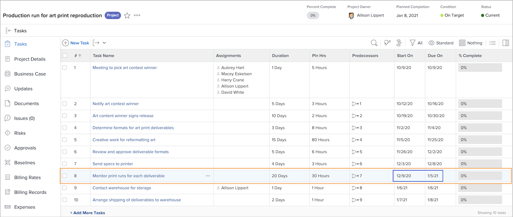

# Impact des congés sur le calendrier des projets

La prise en compte des congés d’un utilisateur ou d’une utilisatrice assigné dans la chronologie du projet dépend d’un paramètre du projet appelé [!UICONTROL Congés de l’utilisateur ou l’utilisatrice]. Ce paramètre détermine si les congés du ou de la cessionnaire principal de la tâche modifient les dates planifiées pour cette tâche dans le projet.

Voyons ce qui se passe avec la chronologie d’un projet lorsque chacun des paramètres est sélectionné : [!UICONTROL Prendre en compte les congés de l’utilisateur ou de l’utilisatrice dans la durée des tâches] ou [!UICONTROL Ignorer les congés de l’utilisateur ou de l’utilisatrice dans la durée des tâches].

## Prendre en compte les congés de l&#39;utilisateur dans la durée des tâches

Cette option est le paramètre par défaut de Workfront.

Dans cet exemple, le ou la cessionnaire principal de la tâche a des jours de congé marqués sur son calendrier personnel.

Le ou la gestionnaire de projet souhaite affecter cette personne à une tâche dont les dates planifiées chevauchent les congés de l’utilisateur ou l’utilisatrice.

Lorsque cette personne est affectée à la tâche, les dates planifiées s’ajustent automatiquement. La date d’achèvement prévue de la tâche a été prolongée de plusieurs jours pour tenir compte des congés de l’utilisateur ou de l’utilisatrice. Il est important de noter que cette modification peut affecter les dates prévues pour d’autres tâches du projet et, éventuellement, la date d’achèvement prévue du projet.

## [!UICONTROL Ignorer les congés de l&#39;utilisateur dans la durée des tâches]

Avec cette option, les dates planifiées de la tâche restent telles qu’elles ont été planifiées à l’origine, même si le ou la cessionnaire principal est en congé pendant la durée de cette tâche.

Le membre de l’équipe a des jours de congé inscrits sur son calendrier.

Le ou la gestionnaire de projet leur assigne une tâche qui chevauche la période de congé. Une fois la personne affectée, les dates planifiées de la tâche restent telles qu’elles ont été planifiées à l’origine.

Pour s’assurer que le travail est effectué dans les délais, il peut être utile de désigner une autre personne qui peut travailler sur la tâche pendant que la personne initialement désignée n’est pas au bureau.

## Ajuster le paramètre au niveau du projet

Pour modifier le paramètre des congés de l’utilisateur ou l’utilisatrice dans un projet :

* Ouvrez le projet en cliquant sur son nom dans Workfront.

* Sélectionnez [!UICONTROL Modifier] dans le menu à 3 points situé dans l’en-tête de la page, à droite du nom du projet.

* Faites défiler jusqu’à la section [!UICONTROL Paramètres du projet] et trouvez le champ [!UICONTROL Congés de l’utilisateur ou l’utilisatrice].

* Sélectionnez l’option que vous souhaitez appliquer à ce projet : [!UICONTROL Prendre en compte les congés de l&#39;utilisateur ou de l’utilisatrice dans la durée des tâches] ou [!UICONTROL Ignorer les congés de l’utilisateur ou de l’utilisatrice dans la durée des tâches].

* Cliquez sur le bouton [!UICONTROL Enregistrer] dans le coin supérieur droit de la fenêtre.

**Note** : ce paramètre n’est pas disponible lorsque vous sélectionnez [!UICONTROL Détails du projet] dans le menu du panneau de gauche de la page du projet.

Il existe un paramètre global pour cela dans les préférences du projet, dans le menu [!UICONTROL Configuration]. Ce paramètre est géré par votre administrateur ou administratrice système. Les administrateurs et administratrices de groupe peuvent être en mesure d’ajuster ce paramètre pour les groupes qu’ils gèrent.

Workfront recommande de définir ce paramètre de la manière dont vous souhaitez que la majorité de vos projets gèrent les congés au sein de votre entreprise.

Le paramètre peut également être intégré dans les modèles de projet, par le biais des détails du modèle.
