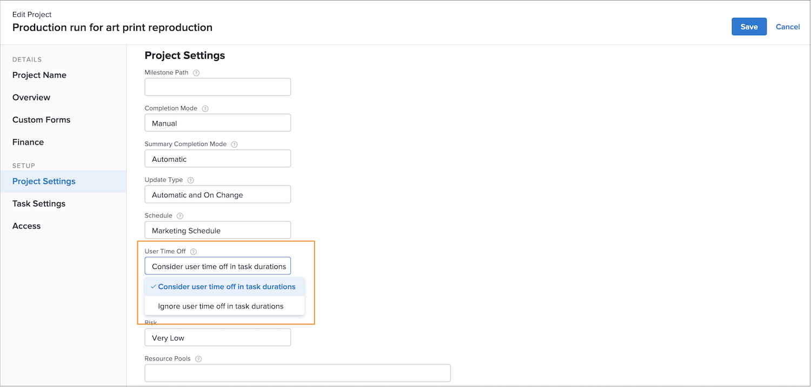

# Comment le délai d’expiration affecte-t-il les calendriers du projet

Si le temps de pause d’un utilisateur affecté dépend d’un paramètre de projet appelé [!UICONTROL Heure de désactivation de l’utilisateur]. Ce paramètre détermine si le temps de pause de la Principale personne désignée de la tâche ajuste les dates prévues pour cette tâche sur le projet.

Regardons ce qui se passe avec la chronologie d’un projet lorsque chacun des paramètres est sélectionné : C[!UICONTROL Tenir compte du temps d’arrêt des utilisateurs dans les durées de tâche] ou [!UICONTROL Ignorer le temps d’arrêt des utilisateurs dans les durées de tâche].

## Prendre en compte les congés de l&#39;utilisateur dans la durée des tâches

Cette option est le paramètre par défaut de Workfront.

Dans cet exemple, la personne désignée Principale pour la tâche a des jours de congé marqué sur son calendrier personnel.

Le chef de projet souhaite affecter cette personne à une tâche dont les dates planifiées chevauchent les heures de congé de l’utilisateur.

Lorsque cet utilisateur est affecté à la tâche, les dates prévues s’ajustent automatiquement. La date d’achèvement prévue de la tâche a désormais été prolongée de plusieurs jours pour s’adapter au temps de congé de l’utilisateur. Il est important de noter que cette modification peut affecter les dates prévues d’autres tâches du projet et, éventuellement, la date d’achèvement prévue du projet.

## [!UICONTROL Ignorer les congés de l&#39;utilisateur dans la durée des tâches]

Avec cette option, les dates prévues de la tâche restent comme initialement prévues, même si la personne désignée Principale a un temps de congé pendant la durée de la tâche.

Le membre de l&#39;équipe a des jours de congé marqués sur son calendrier.

Le chef de projet leur attribue une tâche qui chevauche le temps de pause. Une fois l’utilisateur affecté, les dates planifiées de la tâche restent telles que prévues initialement.

Pour garantir que le travail est effectué à temps, il peut s’avérer utile d’affecter une autre personne pouvant travailler sur la tâche pendant que la personne désignée d’origine est absente du bureau.

## Ajuster le paramètre au niveau du projet

Pour modifier le paramètre de désactivation de l’heure de l’utilisateur sur un projet :

* Ouvrez le projet en cliquant sur son nom dans Workfront.

* Sélectionner [!UICONTROL Modifier] dans le menu à 3 points de l’en-tête de la page, à droite du nom du projet.

* Faites défiler l’écran jusqu’à [!UICONTROL Paramètres du projet] et recherchez les [!UICONTROL Heure de désactivation de l’utilisateur] champ .

* Sélectionnez l’option que vous souhaitez appliquer à ce projet — [!UICONTROL Tenir compte du temps d’arrêt de l’utilisateur dans les durées de tâche] ou I[!UICONTROL Ignorer le temps d’arrêt de l’utilisateur dans les durées de tâche].

* Cliquez sur le bouton [!UICONTROL Enregistrer] dans le coin supérieur droit de la fenêtre.

**Remarque**: Ce paramètre n’est pas disponible lorsque vous sélectionnez [!UICONTROL Détails du projet] dans le menu du panneau de gauche de la page du projet.

Un paramètre global pour ce paramètre existe dans les préférences du projet dans la variable [!UICONTROL Configuration] . Ce paramètre est géré par votre administrateur système. Les administrateurs de groupe peuvent être en mesure d’ajuster ce paramètre pour les groupes qu’ils gèrent.

Workfront recommande que le paramètre soit défini de la manière dont vous souhaitez que la plupart de vos projets prennent en charge le temps libre de votre entreprise.

Le paramètre peut également être intégré à des modèles de projet, par le biais des détails du modèle.
