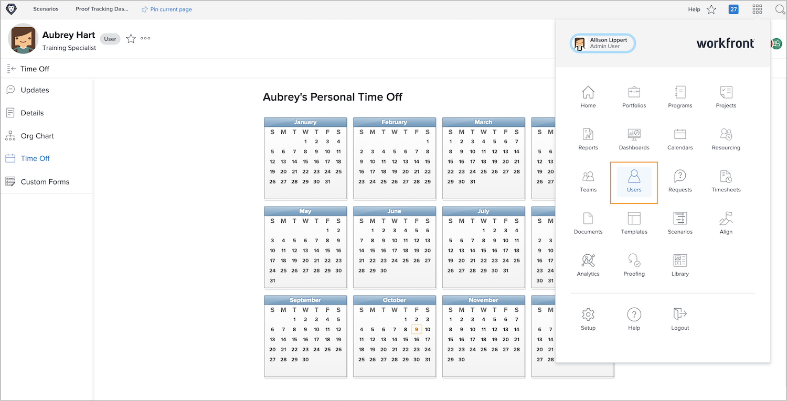

# Gérer les congés des autres utilisateurs et utilisatrices

Les managers ou autres responsables peuvent gérer les calendriers de congés des membres de leur équipe s’ils disposent de l’autorisation Modifier les autorisations de l’utilisateur ou de l’utilisatrice affectées par le biais de leur niveau d’accès à Workfront. Les niveaux d’accès sont créés et affectés par les administrateurs et administratrices système Workfront.

Workfront recommande que votre entreprise dispose d’une politique ou d’une procédure pour les mises à jour par le ou la manager du calendrier des congés personnels d’un employé ou d’une employée.

Pour gérer le calendrier d’un autre utilisateur ou d’une autre utilisatrice :

* Cliquez sur le bouton [!UICONTROL Menu Principal] et sélectionner Utilisateurs/utilisatrices.

* Utilisez l’icône de recherche pour trouver l’utilisateur ou l’utilisatrice ou faites défiler la liste.

* Cliquez sur le nom de l’utilisateur ou de l’utilisatrice dans la liste.

* Cliquez sur [!UICONTROL Congés] dans le menu du panneau de gauche de la page de profil de l’utilisateur ou de l’utilisatrice.

* Cliquez sur une date du calendrier.

* Workfront considère que chaque jour de congé est un jour de congé complet. Si c’est le cas, allez-y et cliquez sur le bouton [!UICONTROL Enregistrer].

* Pour plusieurs jours de congé consécutifs, remplacez la date « Au » par le dernier jour d’absence du bureau. Cliquez sur le bouton [!UICONTROL Enregistrer].

* Si vous marquez un jour de congé partiel, décochez la case [!UICONTROL Jour complet]. Indiquez ensuite les heures pendant lesquelles l’utilisateur ou l’utilisatrice travaillera ce jour-là (les heures durant lesquelles il ou elle est disponible). Cliquez sur le bouton [!UICONTROL Enregistrer].
