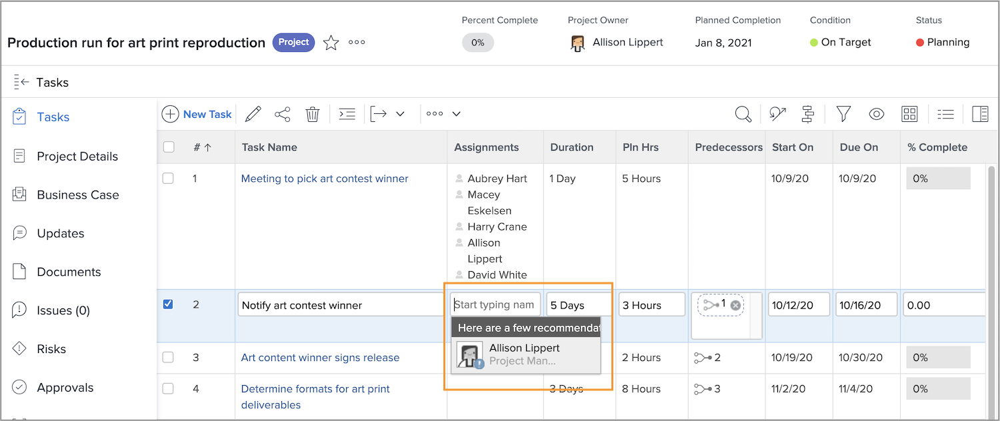

# Voir les congés lors de l’attribution des tâches

Une petite icône indique qu’une personne a des congés marqués sur son calendrier personnel pendant la durée de la tâche lorsque vous affectez des utilisateurs et des utilisatrices.

Lors de l’affectation à partir du plan de projet en tapant le nom d’une personne, son nom est grisé et une petite icône d’avertissement bleue apparaît à côté de l’image de son avatar.

Si vous attribuez des tâches à partir de l’en-tête de la page, une petite icône d’avion bleu apparaît à côté de l’avatar de la personne pour vous avertir qu’elle a des congés pendant la durée de la tâche.

