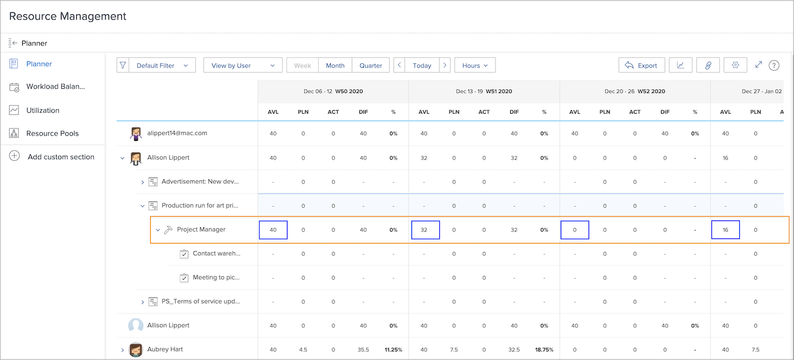
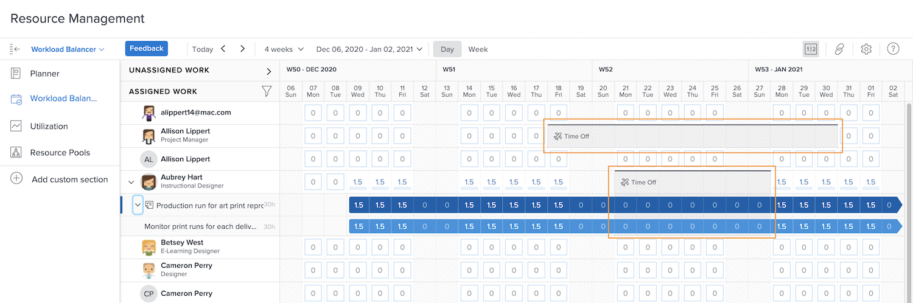

# Visibilité dans les outils de gestion des ressources

Savoir qui est disponible et à quel moment est essentiel pour la planification et la gestion des ressources. Lorsque les utilisateurs et utilisatrices marquent leurs congés personnels dans le calendrier de Workfront, ces informations sont également visibles dans les outils de ressources de Workfront.

## Planificateur de ressources

Les congés d’un utilisateur ou d’une utilisatrice s’affichent dans la colonne Disponible (AVL) du planificateur de ressources. Workfront soustrait les congés indiqués sur leur calendrier du temps disponible, tel que calculé par Workfront selon le planning affecté, le pourcentage de la fonction, etc.

## Équilibreur de charge de travail

Dans l’équilibreur de charge de travail, les congés apparaissent sous forme de barres grises sur le calendrier. Cette visibilité aide les gestionnaires de ressources et d’autres personnes à prendre des décisions plus éclairées lors de l’affectation du travail.

Toutefois, l’indicateur de congés n’empêche pas l’affectation du travail à l’utilisateur ou l’utilisatrice par l’intermédiaire de l’équilibreur de charge de travail. Si le travail est affecté, l’équilibreur de charge de travail indique que la personne est suraffectée pendant la période de congés.

