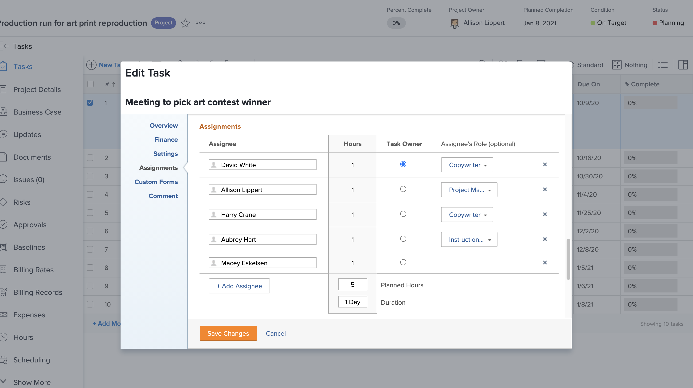

# En quoi consiste un ou une cessionnaire principal ?

Il existe un ou une cessionnaire principal lorsque deux utilisateurs ou utilisatrices ou plus sont affectés à une tâche. Workfront examine le calendrier des congés du ou de la cessionnaire principal lors de l’application des paramètres des congés de l’utilisateur ou l’utilisatrice.

Découvrez qui est le ou la cessionnaire principal sur la page du projet. Cliquez dans le champ Affectations, puis cliquez sur l’icône Affectations avancées dans le coin.

Dans la fenêtre Affectations avancées, le ou la cessionnaire principal, ou propriétaire de la tâche, est désigné par une coche verte. Pointez sur un autre utilisateur ou utilisatrice et cliquez sur le lien Créer un cessionnaire principal pour modifier le ou la propriétaire de la tâche.

Vous pouvez également modifier le ou la cessionnaire principal à partir de la page de la tâche. Cochez la case de la tâche dans la liste des projets, puis cliquez sur l&#39;icône Modifier. Accédez à la section Affectations et cliquez sur le bouton pour désigner le ou la propriétaire de la tâche.

