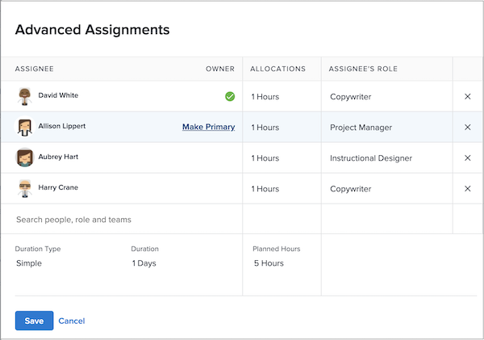

# Qu’est-ce qu’un Principal cessionnaire ?

Il existe une personne désignée Principale lorsque plusieurs utilisateurs sont affectés à une tâche. Le calendrier de désactivation de la personne désignée Principale est ce que Workfront considère lors de l’application du paramètre de désactivation de l’heure de l’utilisateur.

Découvrez qui est la personne désignée Principale sur la page du projet. Cliquez dans le champ Affectations , puis cliquez sur l’icône Affectations avancées dans le coin.

Dans la fenêtre Affectations avancées , la Principale personne désignée ou le propriétaire de la tâche est désignée par une coche verte. Pointez sur un autre utilisateur et cliquez sur le lien Rendre le Principal pour modifier le propriétaire de la tâche.

Vous pouvez également ajuster la personne désignée Principale à partir de la page de la tâche. Cochez la case de la tâche dans la liste des projets, puis cliquez sur l’icône Modifier . Accédez à la section Affectations et cliquez sur le bouton pour désigner le propriétaire de la tâche.

