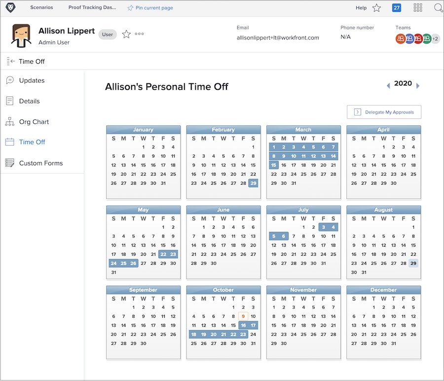
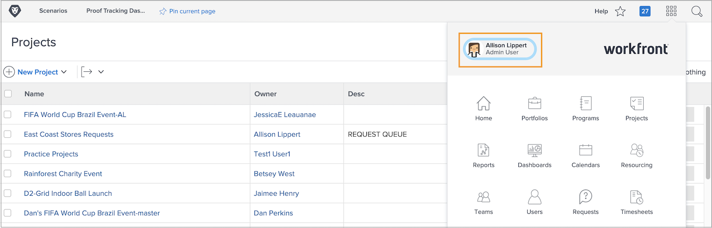

# Pourquoi utiliser le calendrier des congés ?

Lorsque les planificateurs et les chefs de projet assignent des tâches dans Workfront, le fait de savoir quels membres de l’équipe sont disponibles pour terminer le travail assigné contribue à la fin du projet à temps.

Des données de disponibilité précises jouent également dans la planification des travaux actuels et futurs, car les gestionnaires de ressources examinent l’allocation dans les outils de planification et de gestion des ressources de Workfront.

Les utilisateurs de la licence Travailler et Planifier Workfront peuvent utiliser le calendrier des congés personnels pour indiquer quand ils ne seront pas disponibles pendant les heures de travail standard. Même une demi-journée de congé pourrait affecter l&#39;exécution des tâches qui leur sont assignées.

**Remarque**: Workfront n’est pas conçu pour répliquer ou remplacer les systèmes existants de votre entreprise pour gérer, accumuler ou effectuer le suivi du temps libre. Suivez les instructions de votre entreprise pour demander et gérer des congés.

## Marquer votre heure de congé

Votre calendrier de congés personnels figure sur votre page utilisateur de Workfront, accessible à partir du menu principal. Cliquez sur votre nom dans le coin gauche.

* Cliquez sur Heure de désactivation dans le menu du panneau de gauche de votre page utilisateur dans Workfront.

* Par défaut, l’année en cours s’affiche. Au besoin, utilisez les flèches pour sélectionner une autre année (dans le coin supérieur droit de la fenêtre du calendrier).

* Cliquez sur une date du calendrier.

* Workfront suppose que vous prenez toute la journée. Si tel est le cas, allez-y et cliquez sur le bouton Enregistrer .

* Si vous retirez des jours complets consécutifs, remplacez la date À par votre dernier jour d’absence du bureau. Cliquez sur le bouton Enregistrer .

* Si vous ne partez pas toute la journée, décochez la case Toute la journée . Indiquez ensuite les heures que vous comptez travailler ce jour-là (les heures que vous êtes disponible). Cliquez sur le bouton Enregistrer .

Votre temps de congé est indiqué par les cases bleues du calendrier. Ce délai s’affiche également dans d’autres endroits de Workfront pour faciliter la planification des projets et des ressources.

**Conseil**: Si une tâche vous est déjà assignée, alors que vous marquez une pause sur le calendrier, aucune notification n’est envoyée au chef de projet pour l’informer que vous ne serez pas disponible. Veillez à mettre à jour le chef de projet avec tout nouveau temps libre susceptible d’affecter les projets en cours ou le travail qui vous a été assigné.
