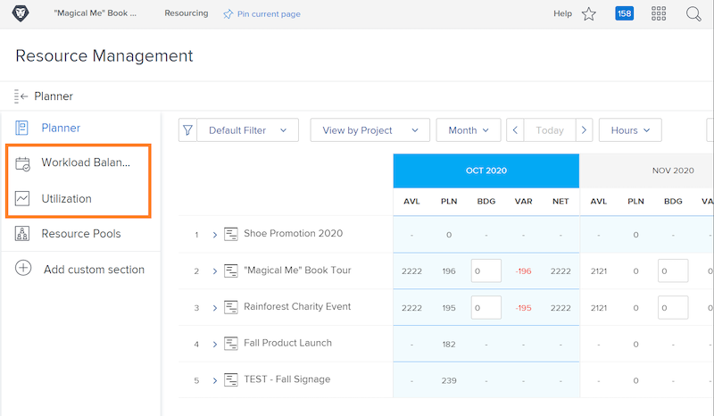

# Configuration de la gestion des ressources, équilibreur de charge de travail et rapport d’utilisation

[!DNL Workfront] données d’offres, sur plusieurs outils dans [!DNL Workfront], afin de faciliter les décisions concernant les ressources et d’améliorer la fluidité de vos processus. Pour savoir ce qui se passe avec vos ressources, assurez-vous que vos gestionnaires, vos utilisateurs et vos projets sont correctement configurés. Ces configurations s’avèrent utiles même si vous ne prévoyez pas d’utiliser l’ensemble des [!DNL Workfront’s] outils de gestion des ressources.

Dans cette section, vous apprendrez :

* Comment configurer des gestionnaires de ressources avec le droit d’accès
* Comment afficher le rapport équilibreur de charge et utilisation

## Configurations de la gestion des ressources

Commençons par nous assurer que les personnes appropriées ont accès aux ressources de votre entreprise et peuvent les administrer.

&lt;!Download the guide for step-by-step instructions.&gt;

## Rapport d’équilibrage et d’utilisation de la charge de travail

En plus du planificateur de ressources et des groupes de ressources, les utilisateurs ont accès à des outils supplémentaires tels que l’équilibreur de charge de travail et le rapport d’utilisation lorsqu’ils disposent de l’autorisation Modifier au niveau de l’accès.

Aucun autre paramètre n’est nécessaire pour accéder aux ressources ou les gérer à l’aide de ces outils.

