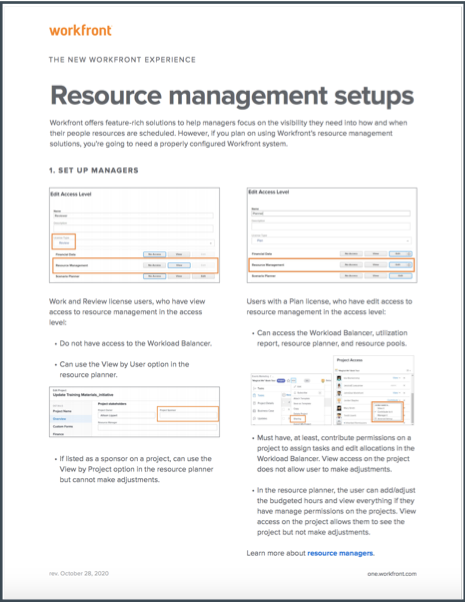

# Configurations de la gestion des ressources, équilibreur de charge de travail et rapport d’utilisation

[!DNL Workfront] fournit des données via de multiples outils dans [!DNL Workfront], pour faciliter vos décisions en matière de ressources et rendre vos processus plus fluides. Pour connaître les activités sur vos ressources, vous devez vous assurer que vos personnes responsables, vos utilisateurs et utilisatrices et vos projets sont correctement configurés. Ces configurations s’avèrent utiles même si vous ne prévoyez pas d’utiliser l’ensemble des outils de gestion des ressources [!DNL Workfront's].

Dans cette section, vous apprendrez :

* Comment configurer des gestionnaires de ressources avec les bons accès.
* Comment afficher l’équilibreur de charge de travail et le rapport d’utilisation.

## La configuration de la gestion des ressources.

Commençons par nous assurer que les personnes appropriées ont accès aux ressources de votre entreprise et peuvent les administrer.

&lt;!Téléchargez le guide pour des instructions détaillées.&gt;

## Équilibreur de charge de travail et rapport d’utilisation

En plus du planificateur de ressources et des groupes de ressources, les utilisateurs et utilisatrices ont accès à des outils supplémentaires tels que l’équilibreur de charge de travail et le rapport d’utilisation lorsqu’ils disposent de l’autorisation Modifier dans le niveau d’accès.

Aucun autre paramètre n’est nécessaire pour accéder aux ressources ou les gérer à l’aide de ces outils.

