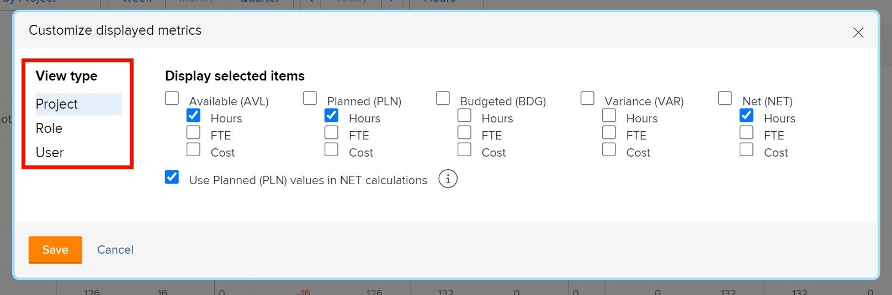

# Vue par fonction dans le [!DNL Resource Planner]

Dans cette vidéo, vous allez :

* Voir l’affichage [!UICONTROL Vue par fonction]
* Découvrez comment les informations des ressources sont affichées dans cette vue

>[!VIDEO](https://video.tv.adobe.com/v/335169/?quality=12&learn=on)

Pour l’option Vue par fonction, la colonne Budgété est affichée par défaut. Elle reprend le nombre estimé de ressources nécessaires pour un projet à partir d’une analyse de rentabilité, si celle-ci a été remplie. Cela signifie également que la colonne Net utilise, par défaut, les chiffres de la colonne Budgété pour vous indiquer la quantité de ressources restantes.

Cependant, il se peut que votre organisation n’utilise pas, ou ne soit pas prête à utiliser, des analyses de rentabilité pour estimer ces quantités. Au lieu de cela, vous utilisez le nombre d’heures prévues déjà saisies sur un projet. Grâce à l’option Personnaliser, vous pouvez choisir les colonnes qui apparaissent dans la vue choisie et la manière dont vous souhaitez que la colonne Net soit calculée.

Pour modifier les colonnes qui apparaissent et le calcul de la colonne Net afin qu’il soit basé sur le nombre d’heures prévues :

* Cliquez sur le menu déroulant Heures et sélectionnez Personnaliser.

* Dans la zone Personnaliser les mesures affichées, déterminez les colonnes qui s’affichent et cochez la case en regard de l’option Utiliser les valeurs planifiées (PLN) dans les calculs NET.

**Note** : vous pouvez modifier les colonnes et les calculs pour les différents types de vue dans le planificateur de ressources en sélectionnant une option sur le côté gauche de la boîte de dialogue.

* Une fois que vous avez cliqué sur Enregistrer, la boîte de dialogue se ferme et l’écran s’actualise.

Le planificateur de ressources montre ce que vous devez savoir sur l’offre et la demande sans avoir recours à des feuilles de calcul complexes et à une communication à tour de rôle.

Avec les informations dont vous disposez et les outils qui sont à votre disposition, vous pouvez affiner la capacité de votre équipe à exécuter le travail qui est important pour vous.
