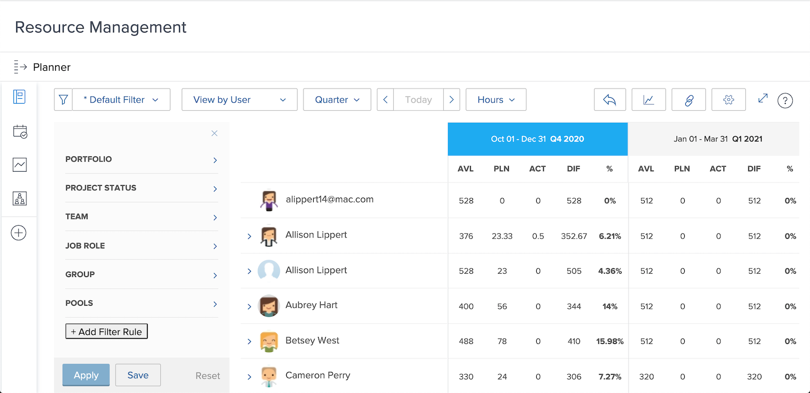

# Afficher l’utilisation et filtrer le planificateur de ressources

Grâce au planificateur de ressources, vous bénéficiez d’une vue d’ensemble claire des projets qui vous intéressent et d’un aperçu en temps réel de la manière dont vos effectifs s’associent pour les exécuter.

* Par exemple, vous souhaitez savoir ce qui arrive à la capacité lorsque la dernière initiative de mise à jour du serveur devient votre priorité.

* Le planificateur de ressources indique la disponibilité de vos effectifs et comment l’allocation de ressources à un projet affectera la disponibilité sur les projets de moindre priorité.

Vous pourrez voir non seulement l’impact de l’allocation des ressources sur le travail d’aujourd’hui, mais en regardant au-delà de vos besoins immédiats de planification des ressources, vous pouvez évaluer les allocations de ressources à plus long terme pour comprendre si des personnes sont sujettes à une allocation trop basse ou trop haute.

## Filtrer le planificateur de ressources

Le planificateur de ressources s’ouvre automatiquement avec un ensemble de filtres par défaut. Vous pouvez modifier ces filtres en procédant comme suit :

* Période
* Portfolio/programme
* Groupes de ressources, etc.

Vous pouvez ainsi vous concentrer sur les ressources disponibles et le moment où elles sont disponibles.
