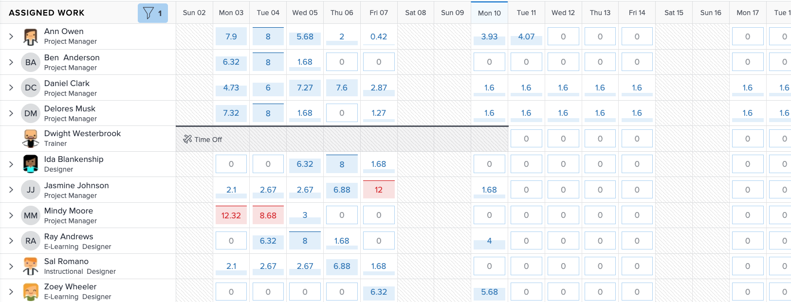

# Recherchez le [!DNL Workload Balancer]

Savoir quelles ressources sont disponibles et comment les distribuer peut être une tâche difficile pour n&#39;importe qui. C’est pourquoi Workfront a créé la variable [!DNL Workload Balancer].

Son objectif est de vous donner plus d’informations et de mieux gérer les charges de travail quotidiennes et hebdomadaires des personnes que vous gérez. Vous pouvez ainsi effectuer de meilleures affectations, en fonction du rôle et de la disponibilité, sur plusieurs projets.

* Cliquez sur [!UICONTROL Ressource] dans le [!UICONTROL Menu Principal].
* Accédez au [!UICONTROL Planification] dans la zone Resource Management.
* Cliquez sur le bouton [!UICONTROL &quot;équilibreur de charge de travail&quot;] qui s’affiche.

## Zones de l’équilibreur de charge de travail

Deux sections s’affichent dans la section [!DNL Workload Balancer]: Travail attribué et travail non assigné.

La zone Travail attribué affiche la liste des utilisateurs et du travail auxquels ils ont déjà été affectés dans Workfront. Par défaut, cette zone est filtrée pour les utilisateurs qui font partie des équipes Workfront auxquelles vous appartenez. Vous pouvez ainsi voir sur quels membres de l’équipe ont été affectés.

La zone de travail Non attribué affiche le travail qui doit encore être attribué, que ce soit à une personne, à un rôle professionnel ou à une équipe. Toutefois, au début, cette zone n’affichera rien.

En commençant par la zone de travail non assignée vide, vous avez la possibilité de vous concentrer d’abord sur les charges de travail actuelles de vos utilisateurs, dans la zone de travail affectée, avant d’effectuer des affectations.
