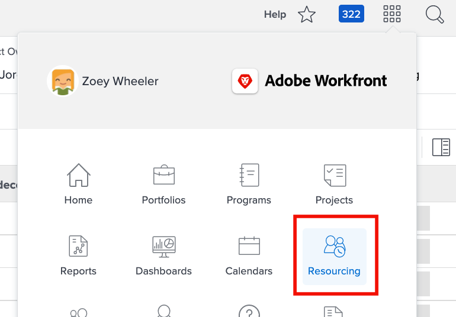

# Rechercher l’[!DNL Workload Balancer]

Découvrez quelles sont les ressources disponibles et comment les distribuer peut être une tâche difficile. C’est pourquoi Workfront a créé l’[!DNL Workload Balancer].

Son objectif est de vous permettre de mieux comprendre et gérer les charges de travail quotidiennes et hebdomadaires des personnes que vous dirigez. Vous pouvez ainsi effectuer de meilleures affectations, en fonction du rôle et de la disponibilité, sur plusieurs projets.

* Cliquez sur [!UICONTROL Ressources] dans le [!UICONTROL menu principal].
* Accédez à la section [!UICONTROL Planification] dans la zone de la gestion des ressources.
* Cliquez sur la section [!UICONTROL « Équilibreur de charge de travail »] qui apparaît.

## Zones de l’équilibreur de charge de travail

Deux sections apparaissent sur l’[!DNL Workload Balancer] : Travail affecté et Travail non affecté.

La zone Travail affecté affiche une liste d’utilisateurs et d’utilisatrices et le travail qui leur a déjà été affecté dans Workfront. Par défaut, cette zone est filtrée pour les utilisateurs et les utilisatrices qui font partie des équipes Workfront auxquelles vous appartenez. Vous pouvez ainsi savoir à quoi les membres de l’équipe ont été affectés.

La zone Travail non affecté présente le travail qui doit encore être affecté, que ce soit à une personne, à une fonction ou à une équipe. Toutefois, au début, cette zone n’affichera rien.

En commençant par vider la zone Travail non affecté, vous avez la possibilité de vous concentrer sur les charges de travail actuelles de vos utilisateurs et utilisatrices, dans la zone Travail affecté, avant de procéder à des affectations.
