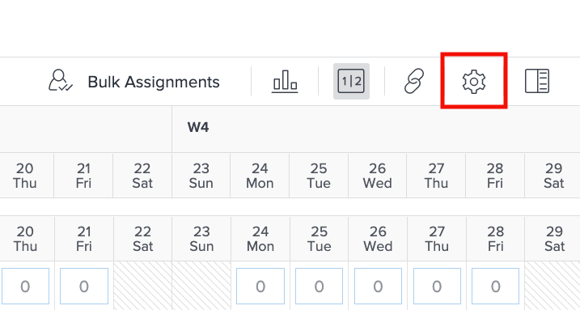
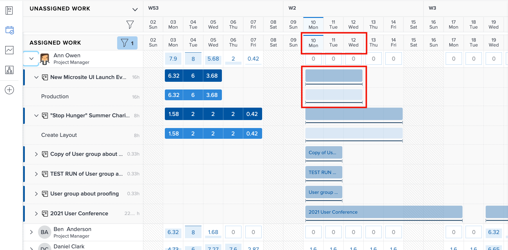
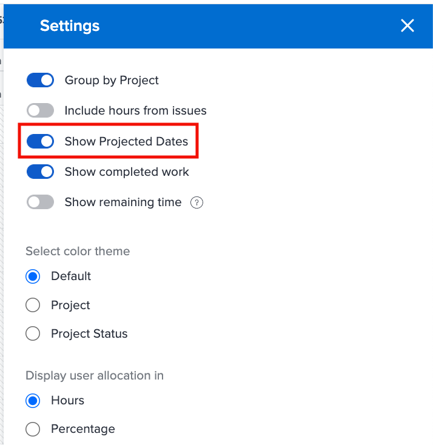

# Paramètres à prendre en compte pour l’équilibreur de charge de travail

Il existe quelques paramètres de l’équilibreur de charge de travail à prendre en compte lorsque vous vous intéressez aux charges de travail individuelles de vos utilisateurs et utilisatrices :

* Affectations des problèmes
* Dates prévisionnelles
* Tâche terminée

Ces paramètres peuvent être activés ou désactivés à l’aide de l’icône Paramètres de l’équilibreur de charge.

## Inclure les heures des événements

Par défaut, l’équilibreur de charge de travail affiche uniquement les tâches. Cependant, les utilisateurs et les utilisatrices peuvent être affectés à des demandes et à des problèmes qui doivent être satisfaits ou résolus et qui mobilisent leur temps de travail sur le projet.

Pour mieux comprendre la charge de travail complète d’un utilisateur ou d’une utilisatrice, Workfront recommande d’inclure les problèmes dans la liste des tâches affectées à l’utilisateur ou à l’utilisatrice.

Il suffit d’activer l’option Inclure les heures des problèmes dans la section Paramètres de l’équilibreur de charge.

Dans la zone Travail affecté, les problèmes apparaissent sous forme de barres marron clair.

### Dates de projets

Une autre option disponible via les paramètres de l’équilibreur de charge de travail consiste à afficher les charges de travail en fonction des dates projetées.

Le paramètre par défaut affiche les tâches affectées en fonction des dates planifiées saisies dans le projet.

Les dates projetées étant basées sur la progression et l’achèvement des tâches précédentes du projet, vous pouvez obtenir une vue « en temps réel » de la date de début ou de fin d’une tâche, ce qui est particulièrement utile pour gérer les charges de travail.

Vous pouvez passer de l’affichage des dates prévues à celui des dates projetées grâce à l’option Afficher les dates projetées dans les paramètres de l’équilibreur de charge de travail.

### Tâches terminées

Les tâches terminées, ainsi que celles qui sont en cours ou sur le point de commencer sont affichées dans l’équilibreur de charge de travail. Pour avoir une meilleure idée du travail supplémentaire que les utilisateurs et les utilisatrices peuvent prendre en charge, vous pouvez exclure les tâches terminées.

Désactivez l’option Afficher les tâches terminées dans les paramètres de l’équilibreur de charge de travail.

