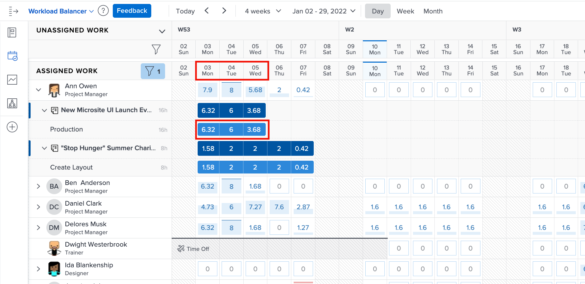

# Paramètres à prendre en compte pour l’équilibreur de charge de travail

Quelques paramètres d’équilibreur de charge de travail sont à prendre en compte lorsque vous examinez les charges de travail individuelles de vos utilisateurs :

* Affectations de problèmes
* Dates prévisionnelles
* Travail terminé

Ils peuvent être activés ou désactivés via l’icône Paramètres de l’équilibreur de charge de travail .

## Inclure les heures des événements

Par défaut, l’équilibreur de charge de travail affiche uniquement les tâches. Cependant, les utilisateurs peuvent être affectés à des demandes et des problèmes qui doivent être remplis ou résolus et qui gagnent du temps qu’ils peuvent consacrer au travail du projet.

Pour mieux comprendre la charge de travail totale d’un utilisateur, Workfront recommande que les problèmes soient inclus dans la liste des tâches utilisateur attribuées.

Il vous suffit de cocher l’option Inclure les heures à partir des problèmes dans la zone Paramètres de l’équilibreur de charge de travail .

Dans la zone de travail affectée, les problèmes apparaissent sous la forme de barres de mise en forme.

### Dates de projets

Une autre option disponible via les paramètres de l’équilibreur de charge de travail consiste à afficher les charges de travail en fonction des dates prévues.

Le paramètre par défaut affiche les tâches affectées selon les dates prévues entrées dans le projet.

Les dates prévues étant basées sur la progression et la fin des tâches précédentes du projet, vous pouvez obtenir une vue &quot;en temps réel&quot; du moment où une tâche va démarrer ou se terminer, ce qui est particulièrement utile lorsque vous examinez les charges de travail.

Vous pouvez basculer entre l’affichage des dates planifiées et prévues avec l’option Afficher les dates prévues dans les paramètres de l’équilibreur de charge de travail.

### Tâches terminées

Les tâches terminées sont affichées dans l’équilibreur de charge de travail avec celles en cours ou sur le point de commencer. Pour mieux comprendre ce que d’autres utilisateurs peuvent accomplir, vous pouvez exclure les tâches terminées.

Décochez l’option Afficher le travail terminé dans les paramètres de l’équilibreur de charge de travail.

