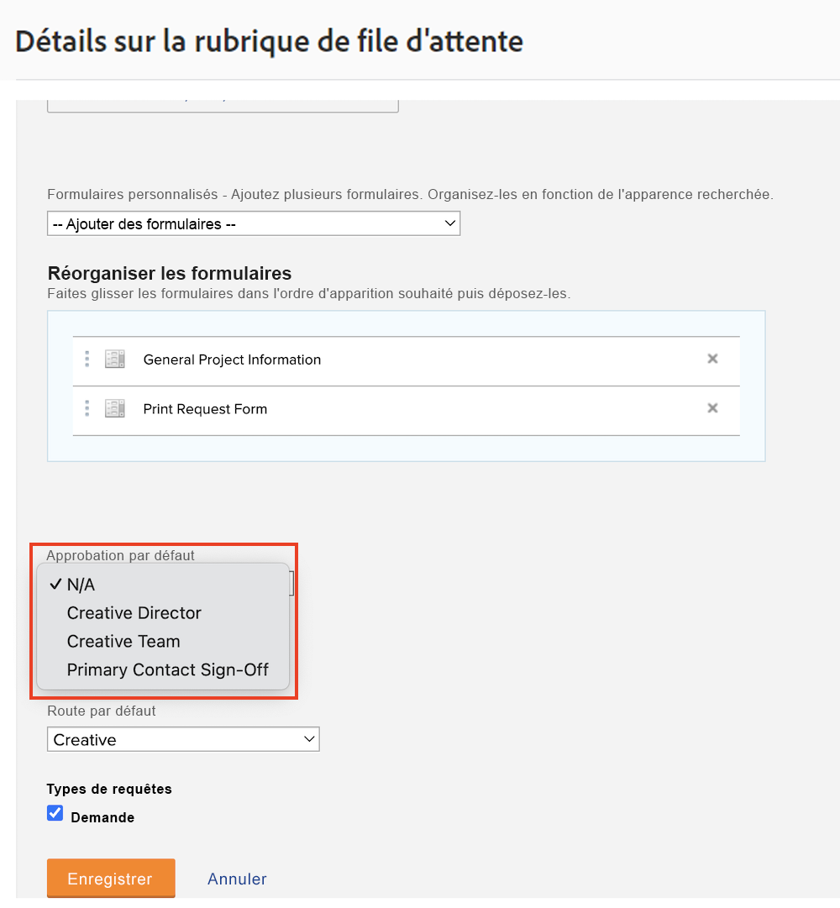
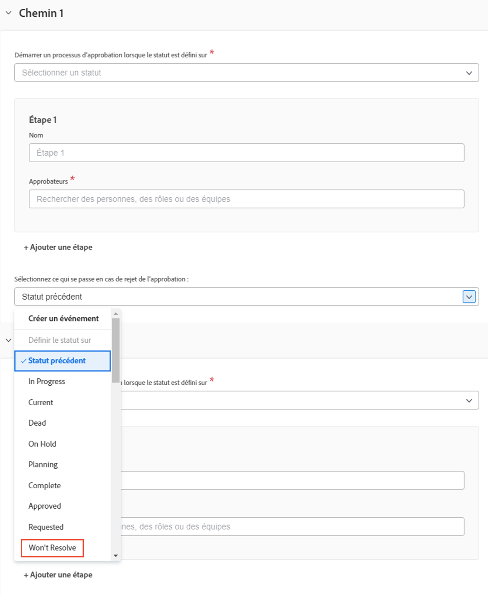

# Créer un processus d’approbation global et à usage unique

Les processus d’approbation des projets, des tâches et des problèmes permettent au ou à la chef de projet d’obtenir la confirmation d’un expert ou d’une experte que le travail a été effectué correctement avant de continuer. Le chef de projet peut créer un processus d’approbation pour chaque situation (processus d’approbation à usage unique) ou choisir parmi une liste de processus d’approbation éventuellement multiples, créés précédemment pour répondre à des besoins communs (processus d’approbation globaux ou existants).

Dans les deux cas, lorsque le statut de l’objet passe à un statut spécifié dans le processus d’approbation, l’approbateur ou l’approbatrice est informé de diverses manières qu’il ou elle doit examiner le travail et l’approuver ou le rejeter. Étant donné que l’ensemble du projet peut être interrompu dans l’attente d’une approbation, les approbateurs ou les approbatrices doivent savoir à l’avance qu’ils ou elles peuvent être invités à donner leur approbation. Si un approbateur ou une approbatrice est absent(e) du bureau pour quelque raison que ce soit, il ou elle peut déléguer ses approbations à un remplaçant qualifié ou une remplaçante qualifiée. Voir [Déléguer des tâches, des problèmes et des approbations](/help/manage-work/approval-processes-and-milestone-paths/delegate-approvals.md) pour plus de détails.

Dans cette vidéo, vous apprendrez à créer un processus d’approbation globale et un processus d’approbation à usage unique sur un projet, une tâche ou un problème.

>[!VIDEO](https://video.tv.adobe.com/v/335225/?quality=12&learn=on)

>[!TIP]
>
>Vous pouvez ajouter un processus d’approbation à usage unique à un projet ou une tâche d’un modèle de projet.

>[!NOTE]
>
>Vous pouvez mettre en place une approbation à usage unique pour les projets et les problèmes de la même manière que celle décrite pour les tâches dans la vidéo.

## Comment appliquer des approbations de problèmes automatiques dans une file d’attente de demandes

Si vous souhaitez configurer des approbations automatiques des problèmes dans une file d’attente de demandes, celles-ci ne peuvent être effectuées qu’à l’aide d’un processus global d’approbation des problèmes et sont appliquées dans une [!UICONTROL rubrique de file d’attente].

Lors de la création ou de la modification d’une [!UICONTROL rubrique de file d’attente], sélectionnez le processus d’approbation globale dans le champ **[!UICONTROL Approbation par défaut]**.

Vous devrez peut-être modifier le processus d’approbation des problèmes pour vous assurer que l’ **[!UICONTROL état précédent]** n’est pas ce que le problème est défini lorsque l’approbation est rejetée. En effet, l’état précédent est **[!UICONTROL New]**, et il s’agit également de l’état qui déclenche le processus d’approbation. Il s’agit donc de l’état sur lequel il sera défini lors de l’approbation. Pour éviter toute confusion lorsque l’approbation du problème est refusée, il est préférable de définir l’état sur **[!UICONTROL Ne pas résoudre]** ou un état personnalisé créé à cet effet.

## Tutoriels recommandés sur cette rubrique

* [Déléguer des tâches, des problèmes et des approbations](/help/manage-work/approval-processes-and-milestone-paths/delegate-approvals.md)
* [Joindre et modifier les processus d’approbation existants](/help/manage-work/approval-processes-and-milestone-paths/attach-and-edit-existing-approval-processes.md)
* [Comprendre les processus d’approbation propres à chaque groupe](/help/administration-and-setup/approval-processes-and-milestone-paths/group-specific-approval-processes.md)
* [Créer un flux de demandes](/help/manage-work/request-queues/create-a-request-flow.md)

