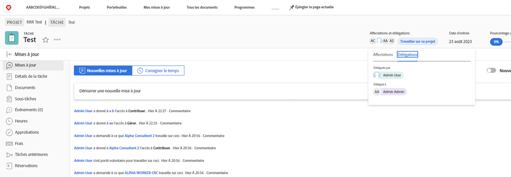

# Déléguer des tâches, des problèmes et des approbations

Découvrez comment déléguer des approbations pour des projets, des tâches, des problèmes et des cartes de pointage à un autre utilisateur ou une autre utilisatrice de Workfront. Apprenez également à déléguer des affectations de tâches et de problèmes.

## Approbations des délégués

Découvrez comment déléguer des approbations pour des projets, des tâches, des problèmes et des cartes de pointage à un autre utilisateur ou une autre utilisatrice.

Dans cette vidéo, vous apprendrez à :

* Affecter des approbations à une autre personne
* Terminer la période de délégation
* Trouver des approbations déléguées

>[!VIDEO](https://video.tv.adobe.com/v/336094/?quality=12&learn=on)

<!---
learn more URLS
Delegate approval request
--->

## Déléguer des affectations de tâches et de problèmes

Vous pouvez déléguer les tâches et les problèmes qui vous sont affectés à d’autres utilisateurs et utilisatrices lorsque vous prévoyez de vous absenter du bureau.

### Activation de la délégation de l’affectation des tâches et des problèmes

Avant de pouvoir être utilisée, la délégation des tâches et des problèmes doit être activée par un administrateur ou une administratrice de système ou de groupe. Pour cela, accédez à [!UICONTROL Configuration > Préférences du projet > Tâches et problèmes > Délégation]. L’activation de cette option permet à toutes les personnes disposant d’une licence en Révision ou supérieure de déléguer les tâches et problèmes qui leur sont affectés.

![Capture d’écran montrant les préférences de [!UICONTROL configuration] pour la délégation](assets/delegation-1.png)

### Délégation des affectations de tâches et de problèmes

Naviguez jusqu’à la page d’[!UICONTROL accueil] et cliquez sur [!UICONTROL Déléguer], puis indiquez l’utilisateur ou l’utilisatrice à qui vous déléguez toutes les tâches qui vous ont été affectées et la période. Vous pouvez désigner n’importe quelle personne disposant d’une licence en Révision ou supérieure.

![Capture d’écran montrant l’onglet de délégation dans la page d’[!UICONTROL accueil]](assets/delegation-2.png)

### Déterminer si une tâche ou un problème a été délégué

Vous déterminerez les cas où des tâches ou des problèmes ont été délégués dans la page d’[!UICONTROL accueil] ou dans la vue des tâches ou des problèmes.

![Capture d’écran montrant l’affectation de tâches déléguées dans la page d’[!UICONTROL accueil]](assets/delegation-4.png)

### Notifications par e-mail applicables au travail délégué

L’administrateur ou l’administratrice de votre groupe ou de votre système peut activer les notifications par e-mail qui vous informeront lorsque vous aurez délégué vos tâches et vos problèmes et lorsque les tâches et les problèmes d’une autre personne vous auront été délégués.

![Capture d’écran montrant les options de notification par e-mail dans [!UICONTROL Configuration] pour la délégation](assets/delegation-5.png)

