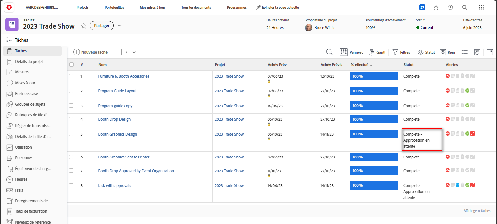
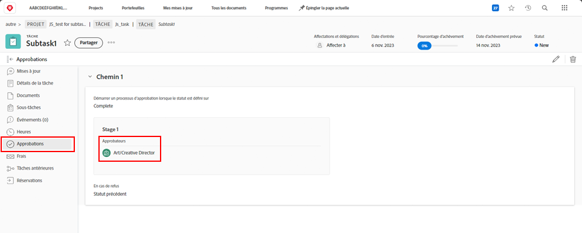

# Terminer les approbations

Les approbations de tâches et de problèmes font partie de nombreux workflows. Mais les approbations non résolues vous empêcheront de définir le statut du projet sur Terminé.

Dans la section [!UICONTROL Tâche] de votre projet, sélectionnez une [!UICONTROL vue] qui inclut la colonne [!UICONTROL Statut]. Un coup d’œil rapide sur cette colonne permet de voir si une tâche a fait l’objet d’une approbation incomplète, avec la mention « [!UICONTROL - Approbation en attente] » après le nom du statut.

Certains choix se présentent à vous :

* **Terminer l’approbation -** Cela peut consister à rappeler aux autres l’approbation en suspens. Vous pouvez voir qui est affecté en tant qu’approbateur ou approbatrice en ouvrant la tâche et en cliquant sur l’onglet Approbations.
* **Supprimer l’approbation -** Si l’approbation n’est pas nécessaire, il peut être plus facile de la supprimer. Votre capacité à le faire dépend de vos autorisations sur [!DNL Workfront].
* **Modifier le statut -** Si l’approbation n’est pas nécessaire, vous pouvez sélectionner un statut sans approbation. Assurez-vous simplement que le statut équivaut à Terminé.

Si votre organisation utilise des problèmes pour effectuer le suivi des complications, modifier les commandes ou d’autres événements pendant les projets, procédez de la même façon dans la section [!UICONTROL Problèmes] de votre projet.
