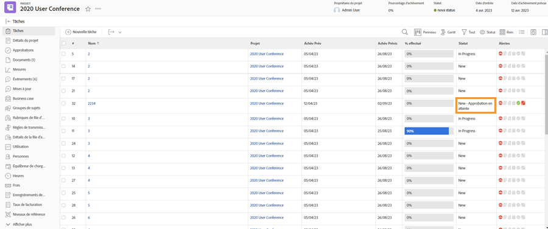

# Approbation complète

Les tâches et les approbations de problèmes font partie de nombreux workflows. Mais les approbations non résolues peuvent vous empêcher de définir l’état du projet sur Terminé.

Sur le [!UICONTROL Tâche] de votre projet, sélectionnez une [!UICONTROL Affichage] qui inclut la variable [!UICONTROL État] colonne . Un rapide coup d’oeil dans cette colonne indique s’il existe une approbation incomplète sur une tâche avec le[!UICONTROL En attente de validation]&quot; après le nom de l’état.

Vous avez le choix entre :

* **Effectuez la validation —** Cela peut signifier rappeler aux autres la validation en cours. Pour ce faire, effectuez une mise à jour via [!DNL Workfront]. Selon votre [!DNL Workfront] autorisations, vous pouvez effectuer vous-même l’approbation.
* **Supprimez la validation —** Si l’approbation n’est pas nécessaire, il peut être plus facile de la supprimer. Votre capacité à le faire dépend de votre [!DNL Workfront] autorisations.
* **Modifiez l’état —** Sélectionnez un état auquel aucune approbation n’est jointe. Assurez-vous simplement que l’état équivaut à Terminé.

Si votre entreprise utilise des problèmes pour suivre les problèmes, modifier les commandes ou d’autres événements pendant les projets, suivez les mêmes étapes dans la variable [!UICONTROL Problèmes] de votre projet.
