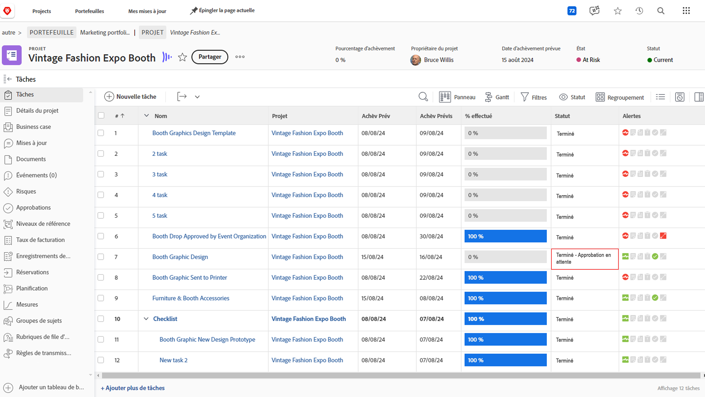

# Terminer les approbations

L’approbation des tâches et des problèmes fait partie de nombreux projets. Mais les approbations non résolues vous empêcheront de définir le statut du projet sur Terminé.

Voici comment les trouver et les traiter.

Dans la section [!UICONTROL Tâche] de votre projet, sélectionnez une [!UICONTROL Vue] qui inclut la colonne [!UICONTROL État], telle que la vue [!UICONTROL État]. Un rapide coup d’oeil vers le bas de cette colonne indique s’il existe une approbation incomplète sur une tâche avec les mots &quot;[!UICONTROL - Autorisation en attente]&quot; après le nom de l’état.

Lorsque vous trouvez une tâche en attente d’approbation, vous avez le choix entre deux actions :

## Effectuer la validation

Cela peut signifier rappeler à la personne affectée la validation en attente. Vous pouvez voir qui est désigné comme approbateur en ouvrant la tâche et en cliquant sur le menu à trois points dans la zone de validation.

Une boîte de dialogue s’affiche avec l’approbateur affecté.

## Supprimer la validation

Si l’approbation n’est pas nécessaire, vous pouvez la supprimer. Pour ce faire, vous devez d’abord rappeler la validation. Cliquez sur le bouton [!UICONTROL Rappeler] dans la zone des approbations. Le statut passe alors à son état précédent et vous permet de supprimer le processus d’approbation.

Cliquez maintenant sur l’onglet [!UICONTROL Approbations] à gauche, puis sur le bouton [!UICONTROL Supprimer] en haut à droite.

## Traitement des approbations de problèmes

Si votre organisation utilise des problèmes pour effectuer le suivi des complications, modifier les commandes ou d’autres événements pendant les projets, procédez de la même façon dans la section [!UICONTROL Problèmes] de votre projet.
