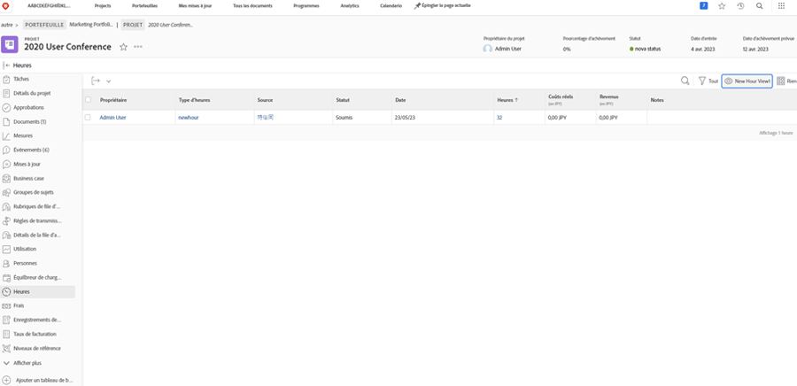

# Journalisation et heures de révision

Si la journalisation des heures réelles travaillées fait partie du workflow de votre entreprise, vous pouvez consulter ces heures sur la page [!UICONTROL Heures] (sélectionnez-la dans le menu du panneau de gauche) sur le projet. Cela affiche toutes les heures connectées à des tâches individuelles et au projet lui-même. Vous pouvez également consigner les heures à partir de cette page.

>[!NOTE]
>
>Votre entreprise peut vous demander d’approuver les heures [!DNL Workfront] timesheets. Vérifiez avec votre interne [!DNL Workfront] pour voir quel processus vous devez utiliser.

<!---
learn more url
Log time
--->
