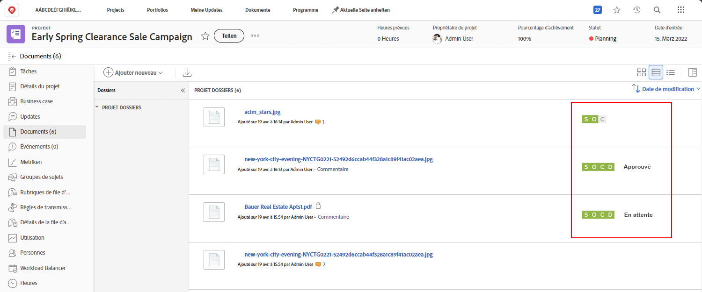
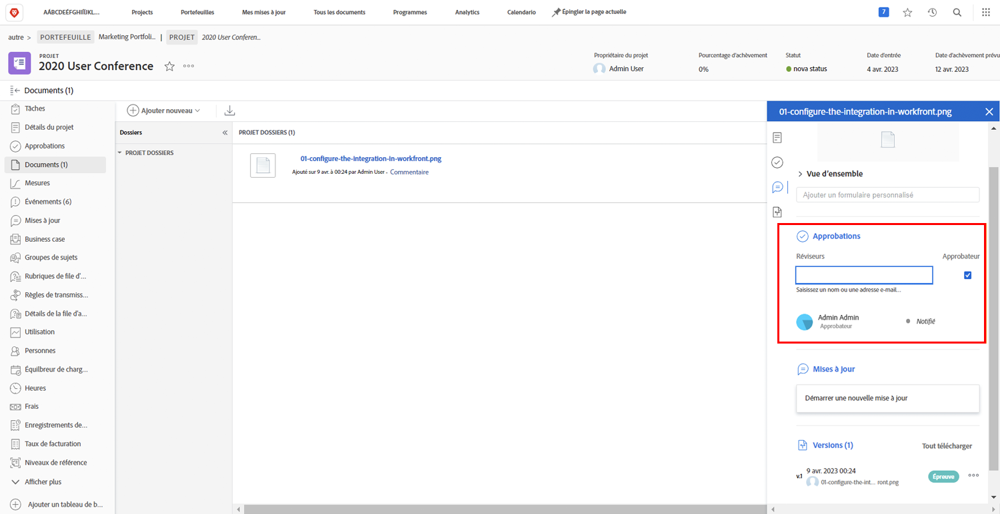

# Charger les ressources

Avant de clôturer un projet [!DNL Workfront], assurez-vous que tous les fichiers pertinents sont joints dans la section [!UICONTROL Documents]. Chargez-les sous la forme d’un document ou d’un BAT, conformément aux directives de votre organisation.

Vous devrez peut-être importer le document ou le BAT en tant que version d’un fichier existant.

Si votre organisation utilise les validations de BAT, assurez-vous que celles-ci sont toutes remplies en jetant un coup d’œil rapide aux icônes de progression.

Et si votre organisation utilise les validations de documents, sélectionnez chaque élément de la liste et vérifiez les détails du document pour voir si les validations sont terminées.

<!---
learn more urls
Create proofs
Add new documents to Workfront
--->
