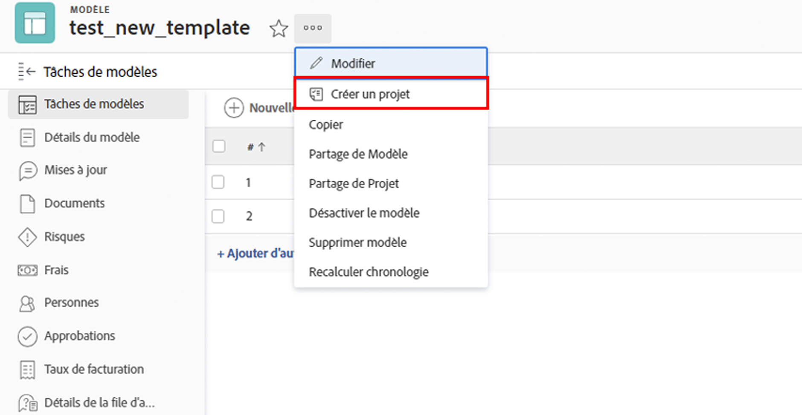
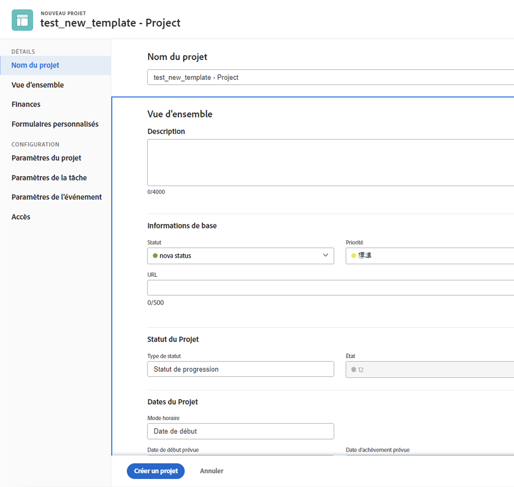
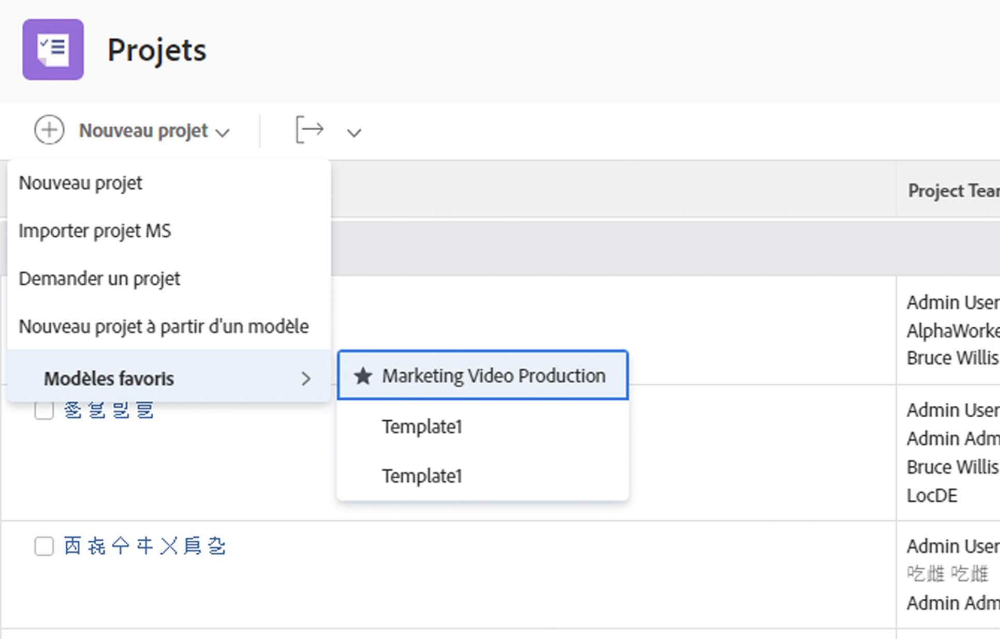

# Créer un projet directement à partir d’un modèle

Si vous travaillez sur un modèle et que vous devez créer un projet à partir de ce modèle, cliquez sur le menu des trois points situé à côté du nom du modèle. Sélectionnez ensuite Créer un projet.

La fenêtre des détails vous permet d’apporter des modifications aux paramètres du nouveau projet.

>[!NOTE]
>
>Pour créer un projet à l’aide de cette méthode, vous devez avoir accès à la zone Modèles de Workfront. Si vous ne pouvez pas accéder aux modèles, vous pouvez toujours utiliser un modèle pour créer un projet à partir de la zone Projets ou lors de la conversion d’un problème/d’une tâche.

>[!TIP]
>
>S’il existe un modèle que vous utilisez souvent, faites-en un favori ! Le modèle apparaît dans le menu Nouveau projet, en plus de s’afficher sous le menu Favoris de la barre de navigation.

