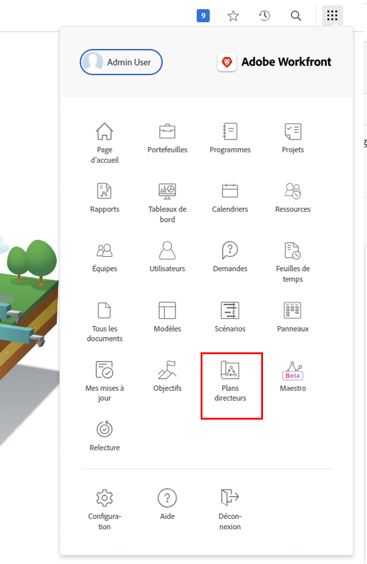

# Création d’un modèle de projet

Dans cette vidéo, vous apprendrez à :

* Créer entièrement un modèle
* Création d’un modèle à partir d’un projet existant

>[!VIDEO](https://video.tv.adobe.com/v/335210/?quality=12&learn=on)

## Création d’un modèle avec des plans directeurs

Les administrateurs système peuvent utiliser des plans directeurs pour créer des modèles de projet. Cette fonctionnalité, située dans le menu principal, vous permet d’accéder à des modèles préconfigurés et prêts à l’emploi qui sont ciblés sur une agence et un niveau de maturité spécifique. Ces modèles permettent aux utilisateurs de commencer à créer des projets répétables et de maintenir la cohérence entre les projets de portée similaire.

Bien que les modèles de projet créés avec des plans directeurs puissent être utilisés lors de la création de projets, vous ne pouvez pas appliquer directement un plan directeur lors de la création d’un projet (par exemple, la conversion d’une tâche ou la demande dans un projet). La principale distinction entre un plan directeur et un modèle de projet réside dans le fait qu’un plan directeur est utilisé pour créer un modèle, alors qu’un modèle de projet est utilisé pour créer un projet.

Pour installer un plan directeur dans vos environnements de production ou d’environnement de test, sélectionnez Plans directeurs dans le menu principal. Parcourez le catalogue ou utilisez l’option Filtrer par type disponible dans le menu de filtrage à droite pour localiser et installer le plan directeur correspondant à vos besoins. Configurez les détails du modèle de projet, tels que le mappage des rôles de tâche du plan directeur aux rôles de tâche de votre entreprise, avant d’installer le plan directeur, si nécessaire. Après avoir installé le plan directeur, vous pouvez apporter des modifications au nouveau modèle en fonction des besoins de votre entreprise.
