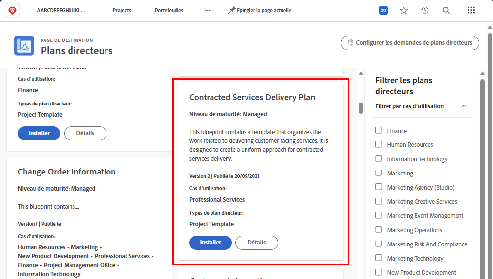
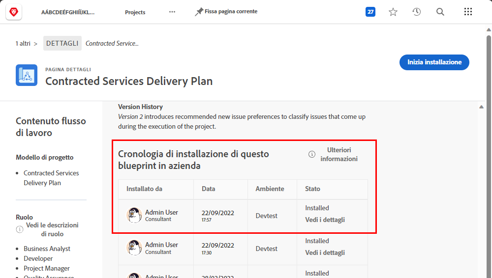
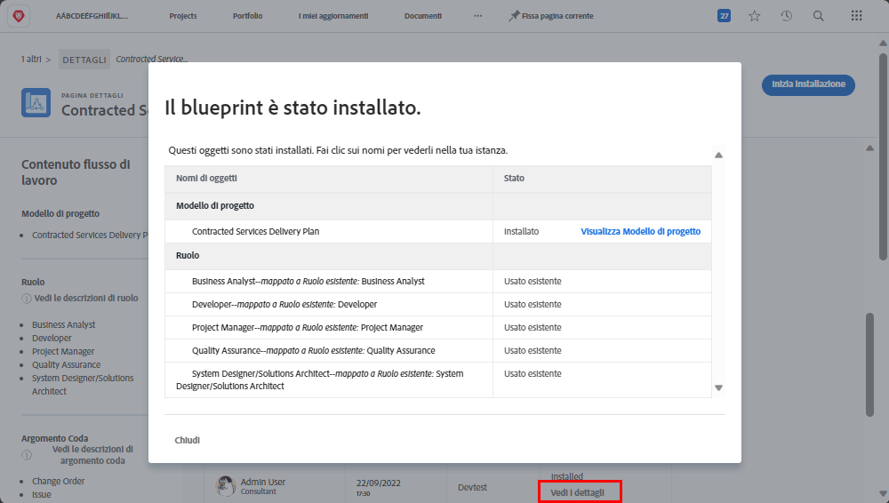

# Créer un modèle de projet et en savoir plus [!UICONTROL Plans directeurs]

Découvrez comment créer un modèle de projet à partir de zéro et d’un modèle existant et comment [!UICONTROL Plans directeurs] vous donne accès à un univers de modèles de projet utiles créés par des experts de Workfront.

## Création d’un modèle de projet

Dans cette vidéo, vous apprendrez à :

* Créer entièrement un modèle
* Créer un modèle à partir d’un projet existant

>[!VIDEO](https://video.tv.adobe.com/v/335210/?quality=12&learn=on)

## Modèles créés avec [!UICONTROL Plans directeurs]

Les utilisateurs de Workfront peuvent utiliser [!UICONTROL Plans directeurs] pour créer des modèles de projet. Cette fonctionnalité, située dans le menu principal, vous permet d’accéder à des modèles préconfigurés et prêts à l’emploi qui sont ciblés sur une agence et un niveau de maturité spécifique. Ces modèles permettent aux utilisateurs de commencer à créer des projets répétables et de maintenir la cohérence entre les projets de portée similaire.

Tout utilisateur sous licence peut parcourir la liste des plans disponibles dans Workfront. Vous ne pouvez pas appliquer directement un plan directeur lors de la création d’un projet (par exemple, lors de la conversion d’une tâche ou d’une requête en projet). La principale différence entre un plan directeur et un modèle de projet réside dans le fait qu’un plan directeur est utilisé pour créer un modèle, alors qu’un modèle est utilisé pour créer un projet. **Le plan directeur doit être installé par un administrateur système pour que le modèle correspondant soit créé.**

Si vous trouvez un plan directeur intéressant, vous pouvez cliquer sur **[!UICONTROL Détails]** pour en savoir plus.

La variable [!UICONTROL Détails] screen explique plus sur le plan directeur, y compris l’historique d’installation si le plan directeur a été installé.

Si le plan directeur a été installé, vous pouvez cliquer sur **[!UICONTROL Voir les détails]** pour obtenir des liens vers le modèle qui a été créé et tout autre objet créé pour prendre en charge le modèle.

Si le plan directeur n’a pas encore été installé, vous pouvez le demander à votre administrateur système.
