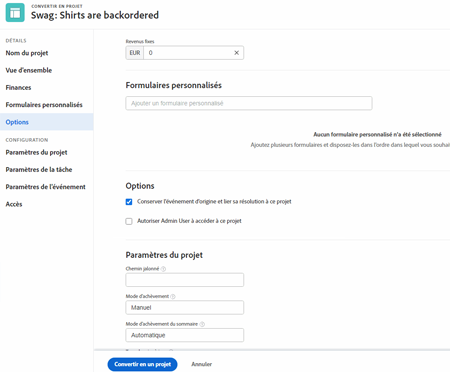
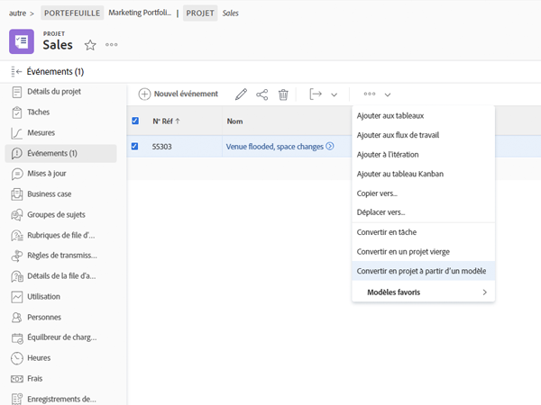

# Convertir des problèmes en d’autres éléments de travail

## Convertir un problème en tâche

Un problème peut être suffisamment important pour que le temps et l’effort pour le résoudre doivent être pris en compte dans le calendrier du projet et affecter les ressources appropriées. Dans ce cas, le problème peut être converti en tâche.

![Une image de la fonction [!UICONTROL Convertir en tâche] option d’un problème dans [!UICONTROL Workfront].](assets/15-convert-issue-to-task-menu-option.png)

1. Accédez au [!UICONTROL Problèmes] section du projet ou de la tâche sur laquelle le problème est connecté. Ou recherchez le problème dans un rapport auquel vous avez accès.
1. Cliquez sur le nom du problème pour l’ouvrir.
1. Dans le menu à 3 points situé à droite du nom du problème, sélectionnez **[!UICONTROL Convertir en tâche]**.
1. Remplissez la variable [!UICONTROL Convertir en tâche] formulaire. Commencez par donner un nom et une description à la nouvelle tâche.
1. Si la nouvelle tâche doit faire partie d’un autre projet, saisissez le nom du projet.
1. Dans le [!UICONTROL Options] , cochez les cases pour conserver le problème d’origine, autoriser l’accès à la nouvelle tâche et conserver la date d’achèvement. Suivez le workflow de votre entreprise lorsque vous effectuez ces sélections. Joignez un formulaire personnalisé si vous souhaitez transférer des données de formulaire personnalisées du problème à la tâche. (Tous les champs qui existent à la fois dans le formulaire d’émission et dans le formulaire de tâche seront automatiquement transférés vers le formulaire de tâche.)
1. Remplissez le formulaire personnalisé, le cas échéant.
1. Cliquez sur **[!UICONTROL Convertir en tâche]** à la fin.

![Une image de la fonction [!UICONTROL Convertir en tâche] forme d’un problème dans [!UICONTROL Workfront].](assets/16-convert-to-task-options.png)

Selon le [!DNL Workfront] paramètres système, vous pouvez modifier les paramètres de la section Options ou non lors de la conversion de la tâche. Ces options affectent à la fois le problème d’origine et la nouvelle tâche.

* **&quot;Conserver le problème d&#39;origine et lier sa résolution à cette tâche&quot;** conserve le problème d’origine et les informations connexes (heures, documents, etc.). Lorsque cette option est sélectionnée, lorsque la tâche est terminée, le problème est marqué comme résolu. Si cette option n’est pas sélectionnée, le problème d’origine sera supprimé à la fin de la tâche. Cela peut avoir une incidence sur la manière dont votre entreprise effectue le suivi des problèmes et génère des rapports sur ces problèmes.
* Le **&quot;Autoriser (nom de l’utilisateur) à accéder à cette tâche&quot;** permet à la personne ayant créé le problème d’accéder à cette nouvelle tâche.
* Le **&quot;Conserver la date d’achèvement prévue du problème&quot;** permet de conserver la date d’achèvement prévue déjà définie sur le problème. Cela définit la contrainte de tâche sur [!UICONTROL Terminer au plus tard]. Si la case est décochée, les dates de la tâche sont définies comme si une nouvelle tâche était créée dans le projet.

La nouvelle tâche est placée au bas de la liste des tâches de votre projet. Déplacez la tâche vers l’emplacement souhaité, affectez un utilisateur ou une équipe à la tâche, ajoutez les heures et la durée planifiées, etc.

>[!NOTE]
>
>Vous ne pouvez pas ajouter de problèmes à la chronologie du projet, car ils représentent un &quot;travail non planifié&quot;. La chronologie du projet est destinée aux &quot;travaux planifiés&quot;, c’est-à-dire aux tâches.

## Convertir un problème en projet

Il arrive qu’un problème ne puisse pas être résolu en traitant le problème lui-même ou en le convertissant en une tâche, car le processus de résolution du problème doit être coordonné de manière plus complexe. Dans ce cas, vous pouvez convertir le problème en projet.

1. Accédez à la section Problèmes du projet ou de la tâche sur laquelle le problème est connecté. Ou recherchez le problème dans un rapport auquel vous avez accès.
1. Cliquez sur le nom du problème pour l’ouvrir.
1. Cliquez sur le menu à 3 points situé à droite du nom du problème pour afficher le menu Plus .
1. Sélectionnez ensuite si vous souhaitez créer un projet totalement vide ou utiliser un modèle de projet, qui préremplit les informations de tâche et de chronologie.
1. Renseignez les informations dans la fenêtre Convertir en projet , en commençant par le nom du projet.
1. Renseignez les autres détails du projet selon les besoins de votre équipe ou de votre organisation.
1. Dans la section Options , cochez les cases pour conserver le problème d’origine et permettre l’accès au nouveau projet. Suivez le workflow de votre entreprise lorsque vous effectuez ces sélections.
1. Remplissez le formulaire personnalisé, le cas échéant. Joignez un formulaire personnalisé si vous souhaitez transférer des données de formulaire personnalisées du problème vers le projet. (Tous les champs existant à la fois dans le formulaire d’émission et le formulaire de projet seront automatiquement transférés vers le formulaire de projet.)
1. Cliquez sur **Convertir en projet** à la fin.

Les champs de détails du projet qui apparaissent dans la fenêtre Convertir en projet dépendent de la méthode utilisée pour créer le projet. Si vous avez utilisé l’option Convertir en projet à partir d’un modèle , vous verrez plus d’informations dans le menu de gauche.

>[!NOTE]
>
>Certaines sections, comme la section Options , bien que visibles, peuvent être inaccessibles en fonction des paramètres du système Workfront de votre entreprise.

* Cliquez sur &quot;**Conserver le problème d’origine et lier sa résolution à ce projet**&quot;. Cette option conserve le problème d’origine et les informations connexes (heures, documents, etc.). Une fois le nouveau projet terminé, le problème est marqué comme résolu. Si cette option n’est pas sélectionnée, le problème d’origine sera supprimé à la fin du projet. Cela peut avoir une incidence sur la manière dont votre entreprise effectue le suivi des problèmes et génère des rapports sur ces problèmes.
* Le &quot;**Autoriser (nom de l’utilisateur) à accéder à ce projet**&quot; permet à la personne qui a créé le problème d’accéder au projet en cours de création.

## Conserver les informations pendant le processus de conversion

<!-- Need link to wf one doc article below 

To learn about what information transfers when you convert an issue to a task or project, we recommend you read through the conversion considerations in the article, Convert issues. This lists what information is kept when converting issues and what isn’t. Workfront recommends you become familiar with these considerations so you don’t lose important information when converting issues to tasks or projects.

-->

Le transfert des données de formulaire personnalisées nécessite :

* Plusieurs copies du même formulaire personnalisé : une pour le problème, puis une pour la tâche ou le projet. Les champs de ces formulaires personnalisés doivent correspondre exactement. Les informations peuvent donc être transférées d’un formulaire personnalisé à l’autre.

* Ou un formulaire personnalisé unique dans lequel les objets de problème, de tâche et/ou de projet sont sélectionnés. Avec cette méthode, il vous suffit de créer et de gérer vos champs personnalisés dans un seul formulaire personnalisé. Il s’agit d’une amélioration récente qui est beaucoup plus facile que de disposer de plusieurs copies du même formulaire, mais l’une ou l’autre de ces méthodes fonctionnera.

<!-- Need link to wf one doc article below

Learn more in the article, Transfer custom form data to a larger work item.

-->

<!-- Pro tips graphic -->

Si vous incluez un formulaire personnalisé dans un modèle de projet, il sera automatiquement attribué lorsque le modèle est sélectionné dans le processus de conversion.

<!-- Learn more graphic and documentation article links 

* Convert issues
* Transfer custom form data to a larger work item
* Overview of resolving and resolvable objects
* Understanding resolving and resolvable objects
* Unlink issues from their resolvable objects

-->

## Convertir un problème en tâche ou projet à partir de n’importe quelle liste de problèmes

Pour accroître l’efficacité de votre travail et faciliter la conversion des problèmes dans un environnement à rythme rapide, vous avez la possibilité de convertir un problème en tâche ou en projet à partir de n’importe quelle liste de problèmes dans un projet, un rapport ou un tableau de bord. Sélectionnez simplement un problème, puis cliquez sur le menu à 3 points qui s’affiche.

