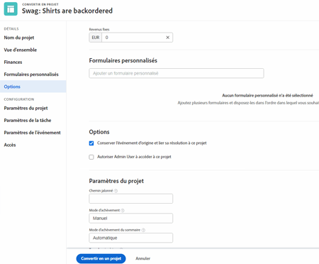
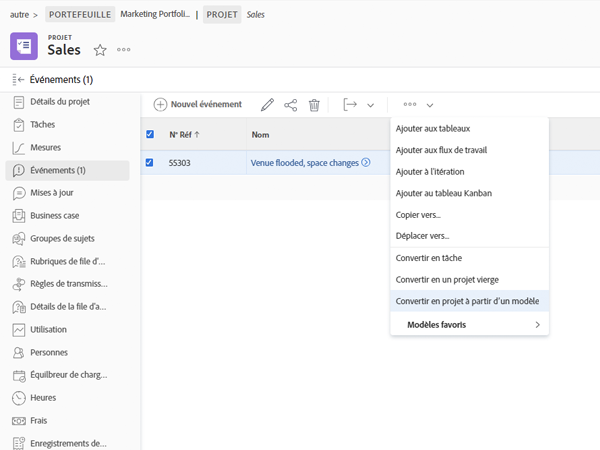

# Convertir un problème/une requête en projet

Dans cette vidéo, vous apprendrez à :

* Examinez les informations envoyées avec la requête.
* Sélectionnez le modèle de projet approprié.
* Terminer la conversion de la requête vers le projet

>[!VIDEO](https://video.tv.adobe.com/v/340343/?quality=12&learn=on)

## Ce que vous devez savoir sur la variable [!UICONTROL Options] section

La variable [!UICONTROL Options] peut être masquée par l’administrateur système s’il souhaite que vous utilisiez les valeurs par défaut qu’il a définies. Si la variable [!UICONTROL Options] s’affiche, où en sont les implications :

**Conservez le problème d’origine et liez sa résolution à ce projet.**

Si cette option est sélectionnée, le problème d’origine sera marqué comme résolu une fois le projet terminé. Si cette option est **not** sélectionné, le problème d’origine sera supprimé lors de la création du projet.

**Autoriser (nom de l’utilisateur) à accéder à ce projet**

Si cette option est sélectionnée, la personne qui a effectué la demande (ou au nom de qui la demande a été faite) se verra automatiquement attribuer des droits d’accès au nouveau projet une fois créé. Si cette option est **not** sélectionnés, ils ne bénéficieront d’aucun droit.

## Conserver les informations pendant le processus de conversion

Le transfert des données de formulaire personnalisées requiert l’une des opérations suivantes :

* Plusieurs copies du même formulaire personnalisé : une pour le problème, puis une pour la tâche ou le projet. Les champs de ces formulaires personnalisés doivent correspondre exactement. Les informations peuvent donc être transférées d’un formulaire personnalisé à l’autre.

* Vous pouvez utiliser un seul formulaire personnalisé dans lequel les objets de problème, de tâche et/ou de projet sont tous sélectionnés. Avec cette méthode, il vous suffit de créer et de gérer vos champs personnalisés dans un seul formulaire personnalisé. Cela est beaucoup plus facile que de disposer de plusieurs copies du même formulaire, mais l’une ou l’autre de ces méthodes fonctionnera.

Si vous incluez un formulaire personnalisé dans un modèle de projet, il sera automatiquement attribué lorsque le modèle est sélectionné dans le processus de conversion.

## Convertir un problème en tâche ou en projet à partir de n’importe quelle liste de problèmes

Pour accroître l’efficacité de votre travail et faciliter la conversion des problèmes dans un environnement à rythme rapide, vous avez la possibilité de convertir un problème en tâche ou en projet à partir de n’importe quelle liste de problèmes dans un projet, un rapport ou un tableau de bord. Sélectionnez simplement un problème, puis cliquez sur le menu à 3 points qui s’affiche.

