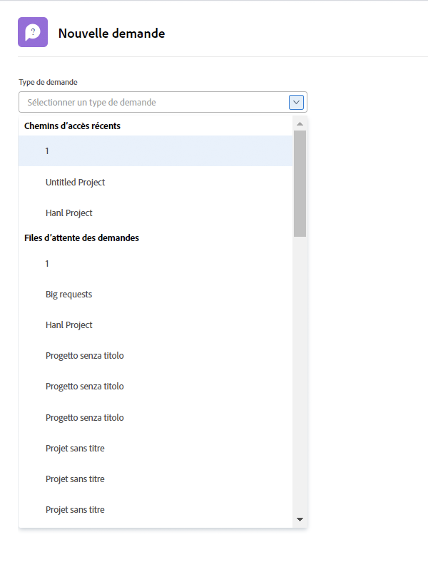
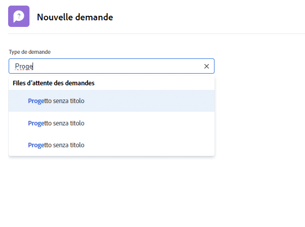
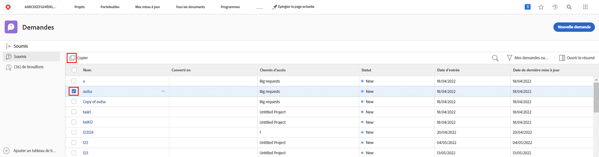
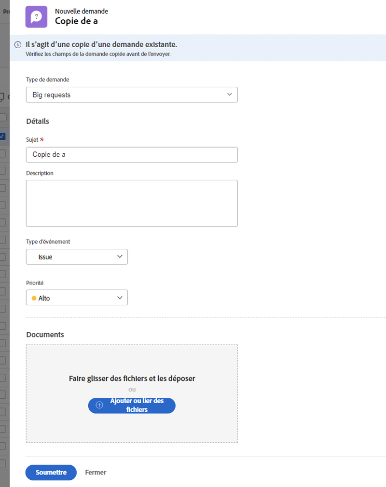

# Effectuer une requête

Dans de nombreuses entreprises, la première étape du lancement d’un nouveau projet, du développement d’un nouveau produit ou de la création d’un livrable consiste à envoyer une demande dans [!DNL Workfront]. Vous pouvez suivre la progression de la requête et fournir des informations supplémentaires si nécessaire.

Dans cette vidéo, vous apprendrez à :

* Accédez à la zone de requête
* Effectuer une requête
* Affichage des requêtes envoyées
* Recherche d’un brouillon de requête

>[!VIDEO](https://video.tv.adobe.com/v/336092/?quality=12&learn=on)

## Accéder rapidement et facilement aux chemins de file d’attente des demandes

Lorsque vous cliquez sur dans le [!UICONTROL Type de requête] , les trois derniers chemins de requête que vous avez récemment envoyés pour s’afficher automatiquement en haut de la liste. Sélectionnez une option pour envoyer une autre requête à cette même file d’attente.

Au bas de la liste se trouvent toutes les files d’attente de demandes auxquelles vous avez accès. Si vous ne savez pas quelle file d’attente utiliser pour votre requête, utilisez la recherche par mot-clé pour trouver rapidement et facilement celle dont vous avez besoin.

Lorsque vous saisissez des mots-clés, [!DNL Workfront] affiche des correspondances afin que vous puissiez trouver le chemin d’accès de la file d’attente de requêtes qui correspond à vos besoins. Par exemple, pour faire une demande pour une publication de réseau social, commencez à saisir &quot;médias sociaux&quot; dans la variable [!UICONTROL Type de requête] et la liste se met dynamiquement à jour pour afficher les correspondances.

Sélectionnez l’option de votre choix, remplissez le formulaire de demande, puis envoyez la demande.

## Copier une requête envoyée pour effectuer une nouvelle requête

Lorsque vous envoyez fréquemment le même type de requête, il est temps de créer chaque nouvelle requête et de remplir les mêmes informations encore et encore. Accélérez le processus en copiant une requête existante, en modifiant uniquement les informations à mettre à jour et en l’envoyant en tant que nouvelle requête.

1. Cliquez sur Requêtes dans le menu principal.
1. Assurez-vous que vous êtes dans la section Envoyé en cochant le menu du panneau de gauche.
1. Recherchez et sélectionnez la requête à copier. Vous ne pouvez copier qu’une seule requête à la fois.
1. Cliquez sur l’icône Copier et envoyer comme nouveau dans le coin supérieur gauche de la liste des requêtes.
1. La fenêtre Nouvelle requête s’ouvre. Le champ Objet est alors mis en surbrillance afin que vous puissiez nommer la nouvelle requête.
1. Mettez à jour d’autres informations dans la requête, si nécessaire.
1. Cliquez sur Envoyer pour terminer.
1. La requête copiée est envoyée en tant que nouvelle requête et apparaît dans votre liste Envoyé.

Vous pouvez copier une requête que vous avez précédemment envoyée, mais vous ne pouvez pas copier un brouillon d’une requête. Vous pouvez copier une requête envoyée par une autre personne tant que vous disposez de l’accès Affichage à la requête.

<!---
Learn more
Requests area overview
Create and submit Workfront requests
Guides
Make a work request
--->
