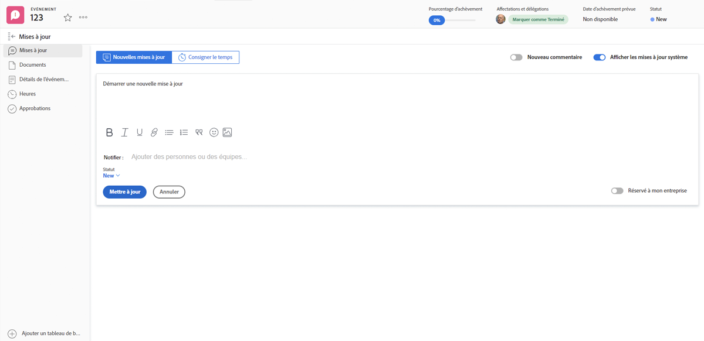
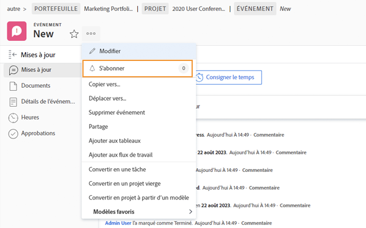
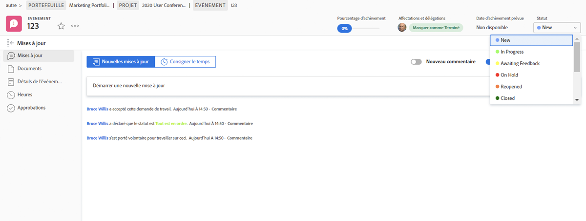
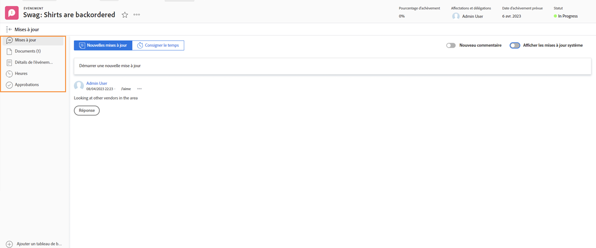

# Gestion des affectations de problèmes

## Attribuer un problème

Journalisation du problème dans [!DNL Workfront] est la première étape pour résoudre les problèmes qui surviennent. L’étape suivante consiste à affecter le problème à un utilisateur individuel, à plusieurs utilisateurs ou à une équipe afin que toutes les tâches associées puissent être terminées et que le problème puisse être résolu.

Attribuer un problème revient à affecter une tâche. Renseignez le champ [!UICONTROL Affectations] champ . Le problème apparaît ensuite dans le [!UICONTROL Liste de tâches] in [!DNL Workfront] [!UICONTROL Accueil]. S’il est affecté à une équipe, il apparaît dans la variable [!UICONTROL Requêtes d’équipe] de la section [!UICONTROL Équipe] page.

Tous les problèmes liés aux tâches et au projet lui-même sont accessibles à partir du [!UICONTROL Problèmes] sur la page du projet. Cela permet aux chefs de projet, aux planificateurs et à d’autres personnes d’attribuer rapidement des problèmes liés au projet.

Il existe plusieurs façons d’affecter des problèmes dans [!DNL Workfront].

* Accédez au [!UICONTROL Problème] sur le projet ou la tâche. Cliquez dans le [!UICONTROL Affectations] pour activer la modification en ligne, puis saisissez le nom de l’utilisateur, des utilisateurs ou de l’équipe qui doit terminer le travail.
Vous pouvez également utiliser la modification en ligne lors de l’affichage de problèmes sur un [!DNL Workfront] rapport.

* Cliquez sur le nom du problème, dans un rapport ou dans la variable **[!UICONTROL Problèmes]** section du projet ou de la tâche. Cliquez ensuite sur dans le **[!UICONTROL Affectations]** dans l’en-tête, en haut à droite de la fenêtre. N’oubliez pas de cliquer sur le bouton **[!UICONTROL Enregistrer]** après avoir saisi un nom d’utilisateur ou d’équipe.

![Image de l’option d’édition en ligne lorsque vous cliquez dans la [!UICONTROL Affectations] champ d’un problème](assets/04-issue-assign-issue-list-assignments-field.png)

<!--
Learn more graphic and documentation article links
Assign issues
Edit user assignments for multiple issues
-->

## Réception d’une affectation de problème

Vous trouverez les problèmes qui vous sont affectés dans la variable [!UICONTROL Liste de tâches] in [!UICONTROL Accueil].

![Image d’une affectation de problème dans la variable [!UICONTROL Liste de tâches] in [!UICONTROL Accueil]](assets/05-workfront-home-work-list.png)

Utilisez la variable [!UICONTROL Filtrer] pour réduire la liste et afficher uniquement les problèmes, le cas échéant.

![Une image de la fonction [!UICONTROL Filtrer] dans le menu [!UICONTROL Liste de tâches] in [!UICONTROL Accueil]](assets/06-workfront-home-issue-filter.png)

Lorsqu’un problème est assigné à une équipe, il apparaît dans la variable [!UICONTROL Requêtes d’équipe] de la section [!UICONTROL Équipe] page. Un membre de l’équipe peut cliquer sur le bouton [!UICONTROL Travailler dessus] pour accepter l’affectation ou un responsable d’équipe peut cliquer sur le bouton [!UICONTROL Réaffecter] pour transmettre la requête à une personne spécifique.

![Une image de la fonction [!UICONTROL Requêtes d’équipe] de la section [!UICONTROL Équipe] page](assets/07-team-page-work-on-it.png)

Les problèmes affectés à l’équipe apparaissent également sur le [!UICONTROL Planification] . Cela permet aux chefs d’équipe et aux autres personnes de voir sur quoi travaillent les membres de l’équipe avant d’affecter la tâche. Faites glisser et déposez la barre d’problèmes à partir du [!UICONTROL Non attribué] pour l’affecter au calendrier d’un membre de l’équipe.

![Une image des affectations de l’équipe dans la variable [!UICONTROL Planification] .](assets/08-issue-assignment-team-schedule.png)

Selon la manière dont votre entreprise dispose [!DNL Workfront] configuré, vous pouvez également rencontrer des problèmes qui vous sont affectés, ainsi qu’à votre équipe, à un rapport qui fait partie d’un tableau de bord.

<!-- Learn more graphic and documentation article links

* Display items in the [!UICONTROL Work List] in the [!UICONTROL Home] area
* Manage work and team requests in the [!UICONTROL Home] area

-->

## Mise à jour des progrès sur les problèmes

Vous et les membres de votre équipe pouvez publier des mises à jour et consigner les heures de travail liées aux problèmes afin de vous donner une idée du travail en cours et de tenir à jour toutes les personnes impliquées dans l’avancement du travail.

Parce qu’il existe plusieurs façons de publier des mises à jour dans [!DNL Workfront], suivez les instructions spécifiques de votre équipe concernant la manière recommandée de fonctionner avec vos configurations système et workflows.

Les mises à jour et les heures peuvent être publiées sur le problème à partir de [!UICONTROL Accueil]. Cliquez sur **[!UICONTROL Nouvelles mises à jour]** pour publier un commentaire.

![Image de publication d’une mise à jour sur un problème à partir de [!UICONTROL Accueil].](assets/09-workfront-home-update.png)

Lorsque vous commentez un problème, vous pouvez diriger le message vers d’autres utilisateurs ou équipes à l’aide de la fonction @name, comme vous le pouvez sur les médias sociaux.

Cliquez sur le bouton **[!UICONTROL Temps journal]** pour enregistrer les heures que vous avez passées à travailler sur le problème.

![Une image des heures de journalisation d’un problème provenant de [!UICONTROL Accueil].](assets/10-workfront-home-log-hours.png)

Vous pouvez également ouvrir le problème (cliquez sur le nom) et y enregistrer vos informations.

## Abonner à un problème

Toute personne ayant accès au problème peut [!UICONTROL S’abonner] qui leur envoie une notification chaque fois qu’une mise à jour/un commentaire est effectué sur le problème. Vous ne recevez pas de notifications lorsque des heures sont enregistrées, que l’état change ou que d’autres modifications sont effectuées.

S’abonner est un excellent moyen pour d’autres membres de l’équipe ou chefs de projet de suivre les travaux qui les intéressent, mais qui ne sont pas affectés ou sur lesquels ils travaillent activement.

<!-- Learn more graphic and link to documentation article

* Update or edit a work item in the Home area

-->

## Mettre à jour l’état du problème

Outre la publication de commentaires ou les heures de connexion, n’oubliez pas de modifier l’état du problème pour indiquer que vous y travaillez. Et puis modifiez-la à nouveau pour indiquer que le travail est terminé.

Modifiez l’état de l’en-tête à partir de [!UICONTROL Accueil] ou lorsque vous avez ouvert la page de publication.

### Problèmes non résolus

Un problème est considéré comme &quot;non résolu&quot; lorsque l’état n’a pas été mis à jour pour être terminé ou équivalent.

Les problèmes non résolus empêchent la tâche à laquelle il est associé d’être marquée comme terminé, ainsi que l’état du projet d’être défini comme terminé.

<!-- Learn more graphic and documentation article link

* Mark a work item as done in the Home area

-->

## Fonctionnalités supplémentaires concernant les problèmes

La page de problèmes permet d’accéder à des informations et fonctionnalités supplémentaires que les membres de l’équipe et les chefs de projet peuvent avoir besoin d’enregistrer et de gérer correctement pour résoudre le problème.

En complément de [!UICONTROL Mises à jour] et [!UICONTROL Heures], d’autres informations sont accessibles à partir du menu du panneau de gauche après l’ouverture du problème.

* **[!UICONTROL Documents]**: téléchargez et consultez des documents relatifs au problème.
* **[!UICONTROL Détails du problème]**: modifiez les informations de problème telles que la description, la priorité, la gravité et la date d’achèvement prévue.
* **[!UICONTROL Approbations]**: configurez un processus d’approbation à usage unique pour le problème ou appliquez un processus d’approbation global. Vous pouvez également suivre l&#39;avancement de la validation dans cette section.

Recherchez les options permettant de copier, supprimer ou partager un problème dans le menu à 3 points situé à droite du nom du problème.

<!-- Learn more graphic and documentation article links

* Edit issues
* Copy issues
* Share an issue
* Move issues
* Grant access to an issue

-->
