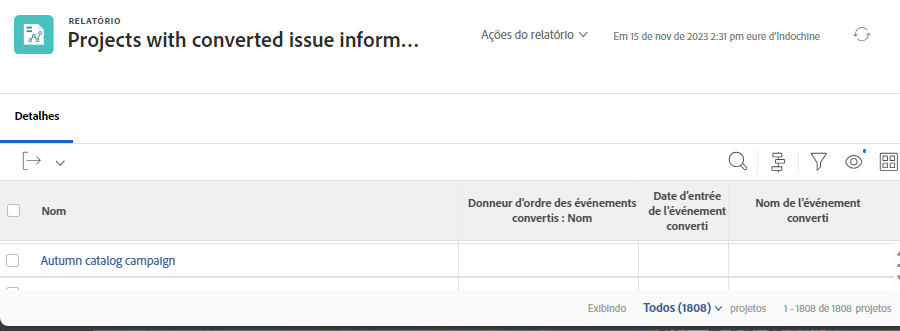

# Rapport sur les problèmes

Découvrez comment centraliser les problèmes en créant un rapport.

## Centraliser les problèmes en créant un rapport

De nombreux responsables de trafic et de projets créent un rapport personnalisé [!UICONTROL Workfront] pour centraliser tous les problèmes entrants. Il est ainsi facile de suivre ce qui est nouveau et ce qui nécessite une attention particulière.

Le rapport peut ensuite être ajouté à un tableau de bord, plaçant tout ce dont vous avez besoin pour effectuer votre travail dans une seule fenêtre [!UICONTROL Workfront].

![Image de la colonne [!UICONTROL Objet de résolution] d’un rapport de problème.](assets/18-resolving-object-report.png)

Pour afficher le nom de la tâche ou du projet vers lequel le problème a été converti, ajoutez la colonne « [!UICONTROL Objet de résolution] » dans la vue. Un « [!UICONTROL Objet de résolution] » est la tâche ou le projet créé lorsque vous convertissez un problème. Si un problème n’a pas été converti, le champ [!UICONTROL Objet de résolution] sera vide. Ce rapport vous permet de voir rapidement quels problèmes ont déjà été convertis, afin d&#39;éviter les doublons. Cliquez simplement sur le nom de l’objet de résolution pour l’ouvrir afin que vous puissiez suivre la progression du travail en cours.

## Afficher les informations du problème initial dans les rapports

Lorsqu’un problème est converti en projet ou en tâche, de nombreux détails du problème initial peuvent être inclus dans les rapports de projet ou de tâche. Le problème initial est alors appelé « [!UICONTROL Problème converti] ».

Un rapport de projet ou de tâche peut afficher ces informations à l’aide de l’objet [!UICONTROL Créateur du problème converti] et de deux champs dédiés. Ces colonnes peuvent être ajoutées à une vue personnalisée sans passer par le mode texte :

* [!UICONTROL Date d&#39;entrée de l&#39;événement converti]
* [!UICONTROL Nom du problème converti]
* [!UICONTROL Créateur du problème converti > Nom]

## Tutoriels recommandés sur cette rubrique

* [Créer une vue de base](/help/reporting/basic-reporting/create-a-basic-view.md)
* [Créer un rapport simple](/help/reporting/basic-reporting/create-a-simple-report.md)
* [Rechercher et gérer des demandes](/help/manage-work/issues-requests/find-requests.md)

