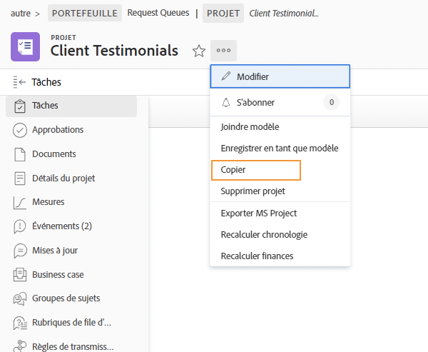
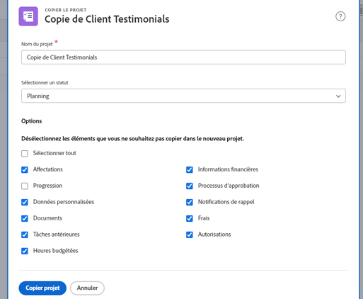

# Copier un projet existant

Parfois, au lieu d’utiliser un modèle pour créer un projet, vous avez simplement besoin de copier un projet pour une autre utilisation ponctuelle. Pour ce faire, vous devez disposer d’une licence standard, avec l’accès Modifier et Créer aux projets.

Accédez au projet que vous souhaitez copier et cliquez sur le menu à 3 points situé à côté du nom du projet. Sélectionnez ensuite Copier.

La fenêtre Copier le projet vous permet de modifier le titre et le statut, ainsi que d’effacer diverses données associées au projet, telles que des affectations, des documents et des données personnalisées.

Le fait de sélectionner Effacer les affectations ou de définir le statut sur Planification empêche le projet copié d’envoyer des notifications d’affectation de tâches juste après la copie.

## Tutoriels recommandés sur cette rubrique

* [Créer un projet directement à partir d’un modèle](/help/manage-work/create-and-manage-project-templates/create-a-project-directly-from-a-template.md)
* [Travailler avec des tâches](/help/manage-work/tasks/work-with-tasks.md)
* [Affecter des tâches à partir du plan de projet](/help/manage-work/tasks/assign-tasks-from-the-project-plan.md)
