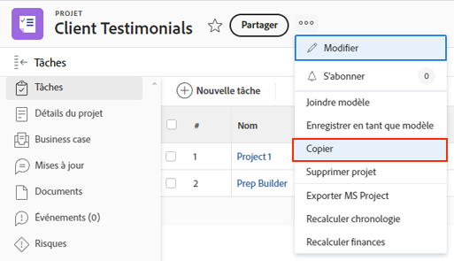

# Copier un projet existant

Parfois, au lieu d’utiliser un modèle pour créer un projet, vous avez simplement besoin de copier un projet pour une autre utilisation ponctuelle. Pour ce faire, vous devez disposer d’une licence Plan , avec l’accès Modifier et Créer aux projets.

Accédez au projet à copier, puis cliquez sur le menu à 3 points en regard du nom du projet. Sélectionnez ensuite Copier.

La fenêtre Copier le projet vous permet de modifier le titre et l’état, ainsi que d’effacer diverses données associées au projet (des options telles que les affectations, les documents et les données personnalisées).

Sélectionnez Effacer les affectations et/ou définissez l’état sur Planification pour empêcher le projet copié d’envoyer des notifications d’affectation de tâche juste après la copie.
